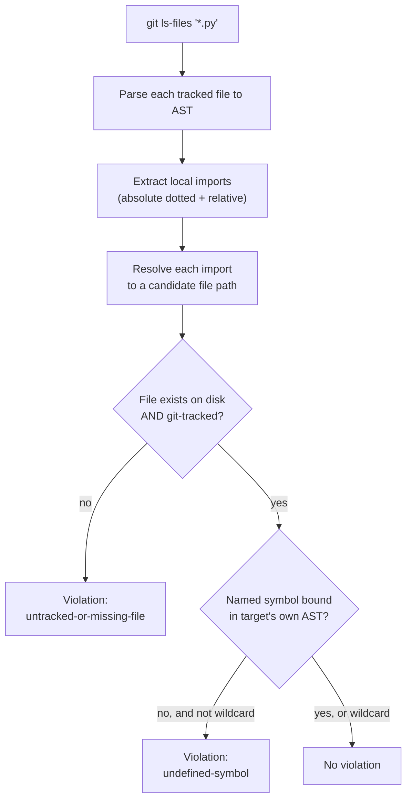

# Local Import Completeness Check - Plan

## Goal Capsule

- **Objective:** Ship an automated, CI-enforced check that would have caught the exact "works on my machine, breaks on a fresh clone" bug fixed in commit `0150a27` — a local import whose target file is missing or untracked, or whose imported symbol is undefined — with no new dependencies, no CI workflow changes, and no shim-maintenance burden.
- **Authority hierarchy:** This plan governs implementation choices. The facts cited under Sources & Research are authoritative over assumptions about current repo state; re-verify them if the repo has moved on.
- **Stop conditions:** Pause and record as an Open Question if implementation discovers dynamic import patterns (`importlib.import_module`, string-based imports, `__import__()`) — those are invisible to AST parsing and the static approach in this plan cannot see them. A `try/except ImportError` around a normal `import X` / `from X import Y` statement is NOT a stop condition: the import statement is still a regular AST node regardless of the surrounding control flow, so the checker sees and verifies it like any other local import (confirmed present today in `action_recognition.py`, `pipeline.py`, and `llm/llm_chat_widget.py` — see Sources & Research).
- **Execution profile:** `code`, Standard depth, single session, 4 implementation units, no phasing.
- **Tail ownership:** Implementer runs `pytest -q` locally before calling the plan done. No deploy or release step is involved — this is a test-only addition.

---

## Product Contract

### Summary

Add a static, AST-based checker that verifies every local (repo-internal) Python import resolves to a git-tracked file and, where a specific symbol is imported, that the symbol is actually defined in the target. Wire it into the existing test suite so it runs automatically via the current `pytest -q` CI step — no new CI workflow, dependency, or heavy-dependency shim required.

### Problem Frame

Commit `0150a27` fixed a fresh-clone breakage: three files existed on the original developer's machine but were never `git add`ed, so `import modules.video_regions`, `import video_ai_editor.vr_video_view`, and `from version import __edition__` all failed after a clean clone. The bug survived at least 2 days and 5 intervening commits of green CI (`691e97f`, `1234b2e`, `49d7991`, `9c09b5e`, `980b759`) because no test exercised those import paths — and the one test that does import `pipeline.py` deliberately mocks out `modules.motion_scene_detect_optimized`, the exact module whose real import pulled in the missing `modules.video_regions` (`tests/test_pipeline_legacy_imports.py:34-44`). An audit run during planning confirmed the current tree is clean (no other untracked-but-imported files, no other undefined symbols in a spot-checked sample) — this plan is a pure safeguard, not a cleanup.

A narrower fix — un-mocking `modules.motion_scene_detect_optimized` in the one existing test — was considered and rejected: it would only have caught the `modules.video_regions` sub-bug, not the unrelated `version.py` `__edition__` sub-bug in the same commit, and it does nothing to prevent the next module a future test happens to mock. A general, mock-independent check is warranted because the bug class (an import whose target silently isn't part of the committed tree) can originate from any test's mock list, not just this one.

### Requirements

**Detection**

- R1. A new automated check detects any local (repo-internal) Python import whose target file is missing from disk or not tracked by git — the exact failure mode behind `modules/video_regions.py` and `video_ai_editor/vr_video_view.py` in `0150a27`.
- R2. The same check detects `from X import name` where `name` is neither defined at module scope in `X` nor bound there by one of `X`'s own top-level import statements (which covers re-export chains, since each link in the chain binds the name directly — see KTD4) — the failure mode behind `version.py`'s missing `__edition__` in `0150a27`.
- R3. The check covers both absolute dotted imports (`import modules.foo`, `from modules import foo`) and relative imports (`from . import foo`, `from .foo import bar` — confirmed present in 5 files: `video_ai_editor/signal_timeline.py`, `video_ai_editor/edit_timeline.py`, `model_training/shared/visualization.py`, `model_training/shared/dataset.py`, `llm/llm_chat_widget.py`).

**Integration**

- R4. The check runs automatically as part of the existing `pytest -q` CI step (`.github/workflows/tests.yml`) — no new workflow file, job, or step.
- R5. The check requires no new third-party dependency and no addition to `tests/conftest.py`'s heavy-dependency shim list — it must work from `requirements-dev.txt` (pytest + numpy) alone, matching the project's existing "5&nbsp;MB install, 5-second runtime" test-suite property (`tests/README.md:39-47`).

**Reliability**

- R6. The check produces zero false positives against the current codebase's legitimate patterns: relative imports, `try/except ImportError`-guarded local imports (confirmed present in `action_recognition.py`, `pipeline.py`, `llm/llm_chat_widget.py`, `main.py`), and any existing re-export idiom (`from .submodule import name`, bare `from . import submodule`, or an aliased `import x as y`) that binds a name at module top level.
- R7. A future maintainer running the check manually (outside pytest) gets a human-readable report without needing to write a driver script.
- R8. Local-root detection does not misclassify an installed third-party package as a repo-internal module solely because a same-named directory exists at repo root — confirmed live collision risk: `packaging/` (holding `packaging/pyinstaller-hooks/hook-optimum.py`) shares its name with the widely-used third-party `packaging` PyPI package.

### Scope Boundaries

- **Deferred to Follow-Up Work:** wiring the checker into a local pre-commit hook. The checker is built as an importable module with a CLI entrypoint (U4) specifically so this is a thin follow-up, not a redesign — but it is not committed to in this plan.
- **Outside this plan:** broader pipeline test coverage. ~74 of 84 tracked `.py` files currently have zero direct test coverage (`tests/README.md`'s own "Phase 0" framing); this plan deliberately narrows to the missing-module bug class only, not a general coverage push.
- **Known limitation, not a defect:** a re-export whose intermediate file exposes the name only via a wildcard import (`from .b import *`) is treated as unverifiable and skipped rather than flagged, since the set of names a `*` exposes isn't visible without recursively resolving the wildcard's own target. Genuinely dynamic import patterns (`importlib.import_module`, `__import__()`, string-based imports) are also out of scope — confirmed absent from the codebase today (see Sources & Research). If either is introduced later, this is a gap to revisit, not a bug in this plan. (`try/except ImportError`-guarded imports are explicitly NOT in this category — see KTD5.)

---

## Planning Contract

### Key Technical Decisions

- **KTD1 — Static AST parsing, not runtime import.** The checker parses source with `ast` and never executes target modules. Rejected alternative A: a runtime smoke-import test extending `tests/conftest.py`'s shim list to cover `PySide6` and anything else `main.py`/GUI code pulls in — reintroduces the exact shim-maintenance burden this plan exists to remove. Rejected alternative B: an off-the-shelf linter (`ruff`/`pyflakes` F821 undefined-name checks, `mypy`). These check whether a name resolves in-process; none of them check whether the resolved file is *git-tracked* — R1's exact bug class (a file present on the author's machine but never committed) is invisible to a linter running on that same machine, since the file exists locally and imports resolve fine there. A linter could partially help with R2 (undefined symbols) but not R1 (the primary failure mode), and would add a new dependency this plan's R5 explicitly avoids.
- **KTD2 — Local-root detection is dynamic, not a hardcoded allowlist, with an explicit third-party-collision guard.** A name is a "local root" if `<repo_root>/<name>.py` exists, or `<repo_root>/<name>/` exists and contains at least one `.py` file anywhere in its tree (handles both regular packages with `__init__.py` — `video_ai_editor`, `llm`, `model_training` — and implicit namespace packages without one — `modules`, `tools`, `training`, confirmed via direct check). Self-updating as the repo grows; avoids the drift a hardcoded list would accumulate. **Collision guard (R8):** before accepting a candidate root, check whether the name also resolves to an installed distribution when the repo root is temporarily removed from `sys.path` (e.g. via `importlib.util.find_spec`); if it does, treat the name as third-party, not local, and exclude it from `local_roots`. This is not a hardcoded exclusion list — it re-derives correctly if the repo ever gains or loses a same-named third-party dependency. Confirmed live case: `packaging/` (holds only `packaging/pyinstaller-hooks/hook-optimum.py`) collides with the third-party `packaging` PyPI package.
- **KTD3 — Checker logic lives in `tools/check_local_imports.py`, not inline in a test file.** `tools/` is the project's existing home for standalone utilities (`export_clip_ov.py`, `labeler.py`, `scrape_listing_probe.py`). Building the checker as an importable module with a `run_check()` entrypoint plus a CLI wrapper (U4) means the same logic serves the pytest gate now and a future pre-commit hook later, at zero extra design cost — it's a thin follow-up (deferred, per Scope Boundaries), not a rewrite.
- **KTD4 — A target file's "defined names" include names bound by its own top-level import statements, not just `def`/`class`/assignment.** Top-level symbol collection for a target file gathers `FunctionDef`/`AsyncFunctionDef`/`ClassDef`/`Assign`/`AnnAssign` names **plus** any name bound by a top-level `Import`/`ImportFrom` statement in that same file — using `alias.asname` when present, else `alias.name`'s last segment. This single rule covers `from .submodule import name` (binds `name`), bare `from . import submodule` (binds `submodule`), and `import x as y` (binds `y`) uniformly, whether the target is `__init__.py` or an ordinary module — no special-casing by file type, and no separate "hop" logic needed: the binding is visible directly in the target file's own AST. A symbol re-exported through two or more files (e.g. `a/__init__.py` does `from .b import name`, and `b.py` itself does `from .c import name`) still resolves in one pass, because `name` is bound directly in `a/__init__.py`'s AST regardless of where `b.py` originally got it — deeper chains are not chased into `b.py` or `c.py`, which is the plan's one documented resolution boundary (see Scope Boundaries).
- **KTD5 — Only genuinely dynamic import patterns are out of detection scope.** `importlib.import_module`, `__import__()`, and other string-based imports are invisible to `ast.parse` and are not analyzed. A `try/except ImportError` around a normal `import X` / `from X import Y` statement is **not** in this category — the import statement is a regular AST node regardless of the surrounding control flow, so the checker parses and verifies it exactly like an unguarded import. This pattern is confirmed present today in `action_recognition.py:28` (`from modules.device_utils import detect_best_device`), `pipeline.py:47-48` (`from modules.transcript import ...`, `from modules.transcript_srt import ...`), `llm/llm_chat_widget.py:39` (`from .llm_timeline_bridge import TimelineBridge`), and `main.py:1905` (`from video_ai_editor.face_identity import FaceIdentityBank`) — all four resolve correctly today and must continue to under R6. Wildcard imports (`from X import *`) are handled: the target file's tracked-and-exists check still applies, but no symbol-level check runs (unverifiable by definition, since the consumed names aren't named in the import statement).

### Assumptions

These are inferred design bets, not decisions the user was asked to confirm (this plan was written in pipeline mode from an in-session brainstorm dialogue that reached scope agreement but not a final confirmed synthesis):

- The checker scans the full tracked-file universe (`git ls-files '*.py'`) rather than a diff-scoped subset — this is a repo-health gate, not a per-PR incremental check, so it should catch pre-existing violations anywhere in the tree, not just newly changed files.
- `models/` (bundled model-weight directory) is correctly excluded from local-root detection because it contains no `.py` files — no special-casing needed, verified as a natural consequence of KTD2's root-detection rule rather than an explicit exclusion.
- The CLI entrypoint (U4) is in-scope for this plan (not deferred) because it costs nothing beyond exposing `run_check()` that U1-U3 already build, and directly enables the deferred pre-commit follow-up without a future redesign.
- `repo_root` resolves via `git rev-parse --show-toplevel` (both for the pytest test and the CLI), not a hardcoded relative path from the checker module's own location — keeps behavior correct if `tools/check_local_imports.py` is ever moved.
- `git ls-files` failure (missing `git` binary, or the working directory isn't a git checkout) is a real, reachable failure mode for R7's manual/CLI use case, not just a theoretical one — `run_check()` catches `FileNotFoundError` and a non-zero return code from the subprocess call and raises a single clear message (e.g. "not a git repository or git not found") instead of letting a raw traceback surface, satisfying R7's "human-readable report" promise even in this path.

### High-Level Technical Design

Pipeline stages map directly to Implementation Units: A-C is U1, D-F is U2, the pytest wiring around this pipeline is U3, and the CLI presentation layer is U4.

---

## Implementation Units

### U1. Local-root detection and import extraction

**Goal:** Enumerate local (repo-internal) import targets from every git-tracked `.py` file's AST — both absolute dotted imports and relative imports — without executing any code.

**Requirements:** R1, R3, R5, R8

**Dependencies:** none

**Files:**
- `tools/check_local_imports.py` (new)
- `tests/test_check_local_imports.py` (new)

**Approach:** Implement `enumerate_local_roots(repo_root) -> set[str]` per KTD2, including the collision guard: for each candidate root name, skip it if `importlib.util.find_spec(name)` succeeds with the repo root temporarily removed from `sys.path` (third-party match). Implement `extract_local_imports(tree, importing_file, local_roots) -> list[LocalImport]` walking `ast.Import` and `ast.ImportFrom` nodes: for `ast.Import`, treat each dotted `alias.name` as local if its first segment is in `local_roots`; for `ast.ImportFrom` with `level == 0`, treat as local under the same first-segment test, capturing imported symbol names or a wildcard flag; for `level > 0` (relative), resolve relative to the importing file's own package directory using `level` — always local by definition. The walk visits every `Import`/`ImportFrom` node in the module regardless of nesting inside `try`/`except`/`if` blocks — control flow does not hide a statement from `ast.walk`. Get the tracked-file universe via one `subprocess.run(["git", "ls-files", "*.py"], cwd=repo_root)` call, not per-file; wrap the call so a missing `git` binary or non-git working directory raises one clear error instead of a raw traceback.

**Patterns to follow:** No existing AST-parsing code in this repo — this is greenfield. Follow the project's flat single-module style (one `tools/check_local_imports.py`, not a new package) and `tests/conftest.py`'s pattern of stdlib-only test dependencies.

**Test scenarios:**
- Happy path: `import modules.foo` recognized as local when `modules` is a known root.
- Happy path: `from modules import foo, bar` captures both symbol names.
- Edge case: `from modules.foo import *` sets a wildcard flag with no symbol list.
- Edge case: `from . import foo` and `from .foo import bar` resolve relative to a given importing file path.
- Edge case: `import numpy` / `from os import path` are correctly excluded (not local roots).
- Edge case: `from pipeline import run_highlighter` inside `main.py` is recognized as local (root-level sibling module, not a subpackage).
- Edge case: `from modules.device_utils import detect_best_device` wrapped in `try: ... except ImportError:` (mirrors `action_recognition.py:28`) is extracted identically to an unguarded import — the walk does not special-case or skip nodes inside exception handlers.
- Edge case: a candidate root name that also resolves to an installed third-party distribution (simulate with a fixture package, or use the real `packaging/` collision) is excluded from `local_roots` by the collision guard.
- Edge case: `enumerate_local_roots` raises one clear, catchable error (not a raw `subprocess.CalledProcessError`/`FileNotFoundError` traceback) when `git` is unavailable or the directory isn't a git checkout.

**Verification:** All listed scenarios pass as unit tests against `ast.parse`'d source strings (no real filesystem or git repo required for most scenarios; the collision-guard and git-unavailable scenarios use a fixture directory and a monkeypatched `subprocess.run` respectively).

---

### U2. Resolution and violation detection

**Goal:** For each local import from U1, resolve it to an expected file path and verify it against the git-tracked set and (for named symbols) against the target file's defined names.

**Requirements:** R1, R2, R6

**Dependencies:** U1

**Files:**
- `tools/check_local_imports.py` (extends)
- `tests/test_check_local_imports.py` (extends)

**Approach:** Implement `resolve_and_verify(local_imports, tracked_files) -> list[Violation]`. Dotted `a.b.c` resolves to candidate paths `a/b/c.py` or `a/b/c/__init__.py`; relative imports resolve via the importing file's directory and `level`. `Violation(kind, importing_file, lineno, detail)` with `kind` in `{"untracked-or-missing-file", "undefined-symbol"}`. Accept the tracked-file set as a parameter (don't reshell to `git` per import) so tests can inject a fake set without a real git repo. For symbol checks, `ast.parse` each target file once (cache per file) and collect its top-level defined names per KTD4: `FunctionDef`/`AsyncFunctionDef`/`ClassDef`/`Assign`/`AnnAssign` names, plus any name bound by a top-level `Import`/`ImportFrom` statement in that same file (`alias.asname` when present, else the bound name). No separate re-export "hop" step is needed — a re-exported name is already in the target file's own binding set by this rule.

**Test scenarios:**
- Happy path: import target exists and is in the tracked set -> no violation.
- Failure path (mirrors `0150a27`'s `video_regions.py`/`vr_video_view.py`): import target file absent from disk entirely -> `untracked-or-missing-file` violation.
- Failure path (the "exists on disk but untracked" sub-case, the actual `0150a27` mechanism): target file present on disk but absent from the injected tracked-file set -> `untracked-or-missing-file` violation.
- Failure path (mirrors `0150a27`'s `__edition__` bug): `from version import __edition__` where the target's AST has no top-level `__edition__` assignment -> `undefined-symbol` violation.
- Happy path: symbol resolves via `from .submodule import name` inside `pkg/__init__.py` when consumer does `from pkg import name` (mirrors `llm/llm_chat_widget.py:39`'s `from .llm_timeline_bridge import TimelineBridge` pattern).
- Happy path: symbol resolves via a bare `from . import submodule` inside `pkg/__init__.py` when consumer does `from pkg import submodule`.
- Happy path: symbol resolves via an aliased `import x as y` inside the target file when consumer does `from target import y`.
- Edge case: wildcard import never produces an `undefined-symbol` violation, but its target's tracked/exists check still runs.
- Edge case: a symbol re-exported through two hops (`a/__init__.py` does `from .b import name`; consumer does `from a import name`) resolves correctly in one pass, without inspecting `b.py` at all, because `name` is bound directly in `a/__init__.py`'s own top-level bindings.

**Verification:** All listed scenarios pass; violations carry enough detail (`file:line`, kind, target) to be actionable without re-running the checker interactively.

---

### U3. Pytest wiring — full-repo assertion

**Goal:** Wire U1+U2 into a pytest test that runs against the real repository and fails with an actionable message if any violation exists.

**Requirements:** R1, R2, R4, R5

**Dependencies:** U1, U2

**Files:**
- `tools/check_local_imports.py` (extends)
- `tests/test_local_import_completeness.py` (new)

**Approach:** Add `run_check(repo_root) -> list[Violation]` to `tools/check_local_imports.py`, composing U1 and U2: resolve `repo_root`, get the tracked-file universe, parse each tracked file to AST, call `extract_local_imports` for each, then `resolve_and_verify` over the combined result. `tests/test_local_import_completeness.py` adds a single test function `test_no_local_import_violations()` calling `run_check(repo_root)` against the real tree and asserting the returned violation list is empty. Format any violations into the assertion message (`file:line -- kind -- detail`, one per line) so a CI failure is diagnosable from the log alone. No `conftest.py` changes — stdlib `ast`/`subprocess`/`pathlib` only, per R5.

**Test scenarios:**
- Happy path: `test_no_local_import_violations` passes against the current, confirmed-clean repo state — this is the production regression-prevention assertion itself.
- `Test expectation:` no additional synthetic scenarios needed here beyond the live-repo run; the checker's own correctness (false positive / false negative behavior) is proven by U1/U2's meta-tests.

**Verification:** `pytest tests/test_local_import_completeness.py -q` passes; the existing `pytest -q` CI command picks it up automatically with no workflow changes (confirmed: `.github/workflows/tests.yml` runs `pytest -q` with no test-path filtering).

---

### U4. CLI entrypoint for manual / future pre-commit use

**Goal:** Add a minimal CLI entrypoint to `tools/check_local_imports.py` so a contributor (or a future pre-commit hook, per Scope Boundaries) can run the same check manually with human-readable output.

**Requirements:** R7

**Dependencies:** U1, U2, U3

**Files:**
- `tools/check_local_imports.py` (extends)

**Approach:** `if __name__ == "__main__":` block that calls the same `run_check()` used by U3, prints one line per violation (`file:line -- kind -- detail`), and exits 1 if any violations exist, exits 0 with a short "no violations" message otherwise.

**Test scenarios:**
- Happy path: invoking the CLI (as a subprocess, or by calling its main function directly) against the real clean tree exits 0 and prints a "no violations" message.
- Failure path: invoking the CLI against a fixture tree seeded with a known violation exits 1 and prints that violation's `file:line -- kind -- detail` line. This is the one behavior U4 adds beyond U1-U3 (the exit-code branch), and it is the exact mechanism a future pre-commit hook would depend on to block a commit — an inverted or dropped exit code here would fail silently for that use case.

**Verification:** `python tools/check_local_imports.py` run manually from the repo root exits 0 on the clean tree and prints a clear one-line summary; the exit-1 fixture scenario is covered by an automated test, not manual-only verification.

---

## Verification Contract

| Command | Applicability | Gate |
|---|---|---|
| `pytest -q` | All units | Existing CI command (`.github/workflows/tests.yml`); must stay green, including the two new test files, with zero new entries in `requirements-dev.txt` or `tests/conftest.py`. |
| `pytest tests/test_check_local_imports.py tests/test_local_import_completeness.py -q` | U1-U3 | Scoped check during development; proves the checker's own logic (meta-tests) and its result against the live repo (integration test) independently. |
| `python tools/check_local_imports.py` | U4 | Manual smoke check; nonzero exit only when a real violation exists. |

---

## Definition of Done

- **Global:** `pytest -q` is green, including `tests/test_check_local_imports.py` and `tests/test_local_import_completeness.py`. No changes to `.github/workflows/tests.yml`, `requirements.txt`, `requirements-dev.txt`, or `tests/conftest.py`.
- **U1/U2:** Every test scenario listed under U1 and U2 passes, including both `0150a27`-mirroring failure paths and the re-export/wildcard edge cases.
- **U3:** `test_no_local_import_violations` passes against the live repository tree.
- **U4:** `python tools/check_local_imports.py` runs cleanly from the repo root with a human-readable summary, and its exit-0/exit-1 branches are covered by an automated test against fixture trees, not manual verification alone.
- **Cleanup:** No stray scratch files or dead-end fixtures left outside `tests/`; any fixture source strings/files used by U1/U2's meta-tests live as proper test fixtures, not temp-directory leftovers.

---

## Sources & Research

- `0150a27b0b66fc34513a66790d616038d518cca7` ("fix: restore missing modules that broke a fresh clone") — the bug this plan guards against. Added `modules/video_regions.py`, `video_ai_editor/vr_video_view.py`, and `version.py`'s `__edition__`.
- `tests/test_pipeline_legacy_imports.py:34-44` — the existing test that imports `pipeline.py` but explicitly mocks out `modules.motion_scene_detect_optimized` (the module whose real import pulled in the missing `modules.video_regions`), which is why CI did not catch the original bug despite running from a genuine fresh clone (`actions/checkout@v4`).
- `tests/conftest.py:37-62` — the current heavy-dependency shim list (`cv2`, `torch`, `whisper`, `googletrans`, `ultralytics`, `openvino`, and others). This plan's checker needs none of these; it never imports target modules.
- `.github/workflows/tests.yml` — full job is `checkout` -> `setup-python@3.12` -> `pip install -r requirements-dev.txt` -> `pytest -q`. Confirms a new file under `tests/` runs automatically with no workflow edit.
- `tests/README.md:39-60` — the project's own "5&nbsp;MB install, 5-second runtime" test-suite constraint and its "no new heavy deps without shimming" rule, both satisfied by this plan's stdlib-only approach.
- Repo-wide import/root scan performed during planning: 84 tracked `.py` files, 42 unique local dotted-import targets, all currently resolving to tracked files; zero `tools.*`/`training.*` package-style imports found (those dirs are script-only today); relative imports confirmed present in exactly 5 files (`video_ai_editor/signal_timeline.py`, `video_ai_editor/edit_timeline.py`, `model_training/shared/visualization.py`, `model_training/shared/dataset.py`, `llm/llm_chat_widget.py`); package-root `__init__.py` presence confirmed mixed (`video_ai_editor`, `llm`, `model_training` have one; `modules`, `tools`, `training` do not, i.e. implicit namespace packages) — both cases must be handled by KTD2's root detection.
- Per-directory tracked `.py` file counts (verified via `git ls-files '<dir>/*.py' | wc -l`, sums to the 84 total above): `modules` 17, `video_ai_editor` 20, `llm` 6, `tools` 3, `model_training` 16, `training` 2, `tests` 9, `packaging` 1, repo-root 10.
- `try/except ImportError`-guarded local imports (a pattern the plan's Stop Conditions originally, incorrectly, treated as unanalyzable) confirmed present at `action_recognition.py:28`, `pipeline.py:47-48`, `llm/llm_chat_widget.py:39`, and `main.py:1905` — all resolve correctly today; see KTD5 for why these are not actually a static-analysis blind spot.
- `packaging/pyinstaller-hooks/hook-optimum.py` is the repo's only file under `packaging/`, confirming the R8/KTD2 name-collision risk against the third-party `packaging` PyPI package.
- `from pipeline import run_highlighter` occurs in `main.py` (lines 528, 2226, 3497), not in `object_recognition.py` as an earlier draft of this plan's U1 test scenarios stated; `object_recognition.py` imports `from modules.device_utils import resolve_device` instead.
