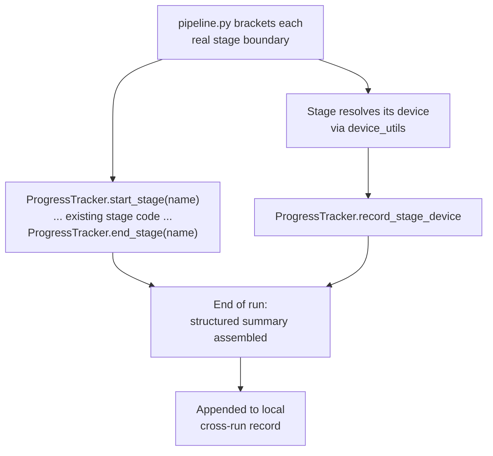

# Pipeline Performance Instrumentation - Plan

## Goal Capsule

- **Objective:** Give the highlight pipeline per-stage timing and device visibility, and fix two already-confirmed device-routing bugs, so 6+ hour processing runs can be diagnosed with real data instead of guesswork.
- **Product authority:** This document. No upstream brainstorm or requirements doc exists for this work.
- **Open blockers:** None. Two implementation-detail questions are deferred to planning (see Outstanding Questions) but do not block scoping.

---

## Product Contract

### Summary

Add per-stage timing + device instrumentation to the highlight pipeline (extending `ProgressTracker`), producing one structured, cross-run-comparable summary each run. Independently, fix two already-confirmed device-routing gaps — Whisper's CUDA-only device check and speaker diarization's hard-coded CPU device — since both are cheap, well-evidenced, and don't need to wait on new data to justify.

### Problem Frame

Some videos take 6+ hours to process end-to-end, but the pipeline has no way today to see where that time goes. `ProgressTracker` (`pipeline.py:31-43`) only forwards percentages to the GUI callback; it never records a duration. The only timer in the entire run is a single whole-run wall-clock measurement (`pipeline.py:806`, `:2233-2237`) — one number for everything from transcript onward. The pipeline's own progress model treats its heaviest block (object detection, action recognition, face work — the 40%→80% band) as one undifferentiated chunk with no finer signal. Any claim about which stage is slow is currently a guess, not a measurement.

Separately, two device-routing gaps are visible from reading the code today, independent of any timing data. Whisper's device selection (`modules/transcript.py:86`) only checks `torch.cuda.is_available()`, bypassing the broader CUDA/XPU/OpenVINO detection that `modules/device_utils.py` already performs for other stages — so on Intel-GPU hardware, Whisper silently runs on CPU. Speaker diarization (`modules/speaker_utils.py:197`) is hard-coded to `device="cpu"` with no device check at all. `device_utils.py`'s own docstring (`:4-11`) claims to be the "one source of truth" for device routing but explicitly excludes both of these consumers from its stated scope.

### Requirements

**Instrumentation**

- R1. The pipeline records, per stage (trim, transcript, motion/scene detection, audio peaks, object detection, action detection, face work, score computation, video cutting, subtitle generation), the wall-clock duration of that stage.
- R2. For any stage that resolves a compute device (transcript, motion, object detection, action detection, and diarization once R6/R7 land), the instrumentation records which device that stage actually used.
- R3. At the end of a run, the pipeline emits one structured summary covering every stage's duration and device — not scattered log lines a reader has to piece together.
- R4. Each run's summary is appended to a local record rather than overwriting the previous run's, so results are comparable across multiple runs and videos.
- R5. Instrumentation adds no new third-party dependency and does not change the pipeline's processing behavior or output (highlight clips, subtitles) — it is purely additive observability.

**Device-routing fixes**

- R6. Whisper transcription resolves its device through the same detection `device_utils.py` already performs for other stages, rather than an isolated `torch.cuda.is_available()` check.
- R7. Speaker diarization resolves its device through the same detection, rather than a hard-coded CPU device.
- R8. Both fixes preserve current transcript and diarization output correctness (text and speaker labels) — only the compute device changes, never the results.

### Key Decisions

- **Structured, cross-run summary over ad hoc log lines.** Duration alone doesn't explain *why* a stage is slow; pairing it with the device actually used, in one place comparable across runs, is what turns "6 hours" into an actionable next step. A minimal log-line-per-stage approach was considered and rejected — it would require manually cross-referencing scattered lines, and there's no time pressure here forcing the cheapest option.
- **Fix the two known device bugs now, not gated on instrumentation data.** Both are already confirmed by reading the code, not hypotheses the new data needs to validate. They're narrow, low-risk changes (route through detection that already exists), so holding them for timing data would just be process overhead.
- **The actual 6+ hour run and resulting prioritization are out of scope for this plan.** Building and verifying the instrumentation is in scope; running it against a real long video and deciding what to optimize next is a follow-up the user does with their own hardware and video.

### Scope Boundaries

**Deferred for later** (contingent on what the instrumentation shows):
- Parallelizing the pipeline's stages — today they run fully sequentially with no threading or multiprocessing anywhere except a UI-only thread.
- Per-stage cache invalidation — today any single config change invalidates the entire cached analysis bundle, forcing a full recompute of every stage even when only one changed.
- A GPU/OpenVINO path for face detection/recognition — currently CPU-only by design (OpenCV DNN backend for YuNet/SFace), a harder architectural change than a device-routing fix.

**Outside this plan:**
- Actually running a 6+ hour video and interpreting the resulting data. There's no access to that hardware or a matching video in this environment; the user does this after the instrumentation ships.

### Dependencies / Assumptions

- Assumes `device_utils.py`'s `detect_best_device()` reports device strings compatible with what Whisper and the diarization library (Resemblyzer) expect. If either needs its own device-string format, R6/R7 may need a small adapter rather than a direct reuse — a planning-time detail, not a scope change.
- A run cached *before* the R6/R7 fixes land will still show pre-fix (CPU-computed) results afterward if the cache signature doesn't change — transcript and diarization output are device-invariant, so this is not a correctness issue, but a fresh (non-cached) run is needed to actually observe the fix's speed effect.

### Outstanding Questions

**Deferred to Planning:**
- Exact form of the structured per-run summary (a table logged to the existing debug-log channel, a small JSON/CSV file, or both) — an implementation choice, not a product decision.
- Whether the appended cross-run record (R4) needs a size or retention bound over time.

### Sources & Research

- `pipeline.py:31-43` — `ProgressTracker`, percentage-only, no duration captured.
- `pipeline.py:806`, `:2233-2237` — the only wall-clock timer in the pipeline, one number for the whole run.
- `pipeline.py:1240-1253` — existing awareness that R3D-on-CPU is slow; the codebase already routes around it for that one stage, evidence the device-routing pattern this plan generalizes is a known, accepted fix shape here.
- `modules/device_utils.py:4-11` — docstring scope explicitly excludes Whisper and diarization from its stated "one source of truth."
- `modules/device_utils.py:26-127` — `detect_best_device()` priority: CUDA > Intel XPU > OpenVINO-visible Intel GPU > CPU fallback.
- `modules/transcript.py:86-91` — Whisper's isolated `torch.cuda.is_available()` check.
- `modules/speaker_utils.py:197` — diarization's hard-coded `device="cpu"`.
- `modules/video_cache.py` — whole-bundle cache keyed by a params signature; any change invalidates the entire cached bundle, not just the affected stage.
- Repo-wide grep for `threading|multiprocessing|concurrent.futures|asyncio` in `pipeline.py`: one hit, a UI-only thread at `pipeline.py:2287-2288` — confirms all ML stages run strictly sequentially today.

---

**Product Contract preservation:** Unchanged. Planning added the sections below without modifying any R-ID or existing Product Contract text. Planning research sharpened (did not contradict) the Dependencies/Assumptions note about a possible device-string adapter — see KTD1 below for what that research found.

## Planning Contract

### Key Technical Decisions

- **KTD1 — A new `DeviceInfo` field for Whisper/diarization, not a reuse of `pytorch_device`.** Planning-time research into `modules/device_utils.py:26-127` found that `pytorch_device` is deliberately forced to `"cpu"` in *both* the Intel XPU branch and the OpenVINO-GPU branch — not just the CPU-fallback branch. That's intentional: `pipeline.py:1240-1253`'s own comment explains the codebase routes R3D action-recognition away from Intel GPU compute on purpose (OpenVINO handles Intel GPU instead). Reusing `pytorch_device` for Whisper/diarization would leave them stuck on CPU on Intel-GPU hardware — identical to today's broken behavior, defeating R6/R7. `DeviceInfo` uses `__slots__` (`device_utils.py:159-166`), a fixed field set, so this requires adding a new slot (e.g. `general_torch_device`) rather than extending a dict. It resolves `"cuda:0"` on CUDA, `"xpu:0"` on Intel XPU (this codebase's torch build already exposes `torch.xpu` natively per `device_utils.py:70-71`'s own comment), and `"cpu"` in the OpenVINO-GPU-only and CPU-fallback branches (no raw-torch XPU path exists there — OpenVINO probes the GPU without importing `torch.xpu` at all).
- **KTD2 — Graceful CPU fallback if the new device string fails at model-load time.** No existing consumer in this codebase uses raw PyTorch XPU tensors — the established Intel-GPU pattern here is always "route through OpenVINO," never "hand XPU tensors to an arbitrary PyTorch model." Whisper-on-XPU and Resemblyzer-on-XPU are therefore unvalidated combinations with no local hardware available to test them. Wrap each model-load call in a try/except that retries with `device="cpu"` and logs the fallback, rather than crashing a run over an unproven hardware path.
- **KTD3 — `ProgressTracker` gets an explicit `start_stage`/`end_stage` API; inferring durations from `task_name` transitions does not work in this codebase.** Verified directly against `pipeline.py`: nearly every top-level `progress.update_progress(...)` call shares the literal `task_name` `"Pipeline"` (trim at `:523`, transcript at `:740`, motion at `:810`, audio peaks at `:933`, object-detection setup at `:943`, score-computation start at `:1473`, video cutting at `:2102`/`:2134`, subtitles at `:2190`/`:2203`) — inferring stage boundaries from `task_name` changes would collapse most of R1's ten stages into one undifferentiated "Pipeline" bucket, reproducing the exact problem this plan exists to fix. Worse, transcript (`pipeline.py:747`) and object/keypoint detection (`pipeline.py:1062`/`:1078`/`:1104`) are called with the raw `progress_fn` callback passed straight through — not `progress.update_progress` — so `ProgressTracker` never observes their internal `"Transcription"`/`"Object Detection"` task-name transitions at all. Face work (`compute_forbidden`, `pipeline.py:1448`) takes no progress callback whatsoever. Given this, `ProgressTracker` instead exposes explicit `start_stage(name)` / `end_stage(name)` methods, called directly at each real stage boundary already present in `pipeline.py`'s top-level control flow (the existing `# Step N:`-style comments mark these boundaries) — one pair per R1 stage, bracketing the existing code block. This does add new call sites in `pipeline.py`, but zero changes inside `transcript.py`, `object_recognition.py`, or `compute_forbidden.py` — the wrapping happens at the one place (`pipeline.py`) that already sequences every stage. Device is reported separately via one small explicit registration call from the handful of places that already resolve a device.
- **KTD4 — The structured summary write is best-effort, never fatal.** A failure to write the summary (disk full, permissions) is logged and swallowed, matching `debug_console.py`'s own "log and continue" pattern for its log-file I/O — instrumentation must never be the reason a real run fails (R5).

### High-Level Technical Design

Duration tracking (left branch) and device tracking (right branch) are independent, low-touch additions to each stage's existing call sites; they converge only once, at the end-of-run summary assembly.

---

## Implementation Units

### U1. Add a general (non-R3D) PyTorch device field to `DeviceInfo`

**Goal:** Extend `modules/device_utils.py` so `detect_best_device()` populates a new field usable by Whisper/diarization, without disturbing `pytorch_device`'s existing R3D-specific meaning.

**Requirements:** R6, R7 (foundation)

**Dependencies:** none

**Files:**
- `modules/device_utils.py` (extends)
- `tests/test_device_utils.py` (new)

**Approach:** Add a new `__slots__` entry to `DeviceInfo` (e.g. `general_torch_device`). Populate it per branch in `detect_best_device()`: `"cuda:0"` in the CUDA branch, `"xpu:0"` in the Intel XPU branch (`torch.xpu.is_available()` is already checked there), `"cpu"` in the OpenVINO-GPU-only and CPU-fallback branches. Do not change `pytorch_device`'s existing value in any branch — per KTD1, that field's CPU-forcing on Intel hardware is intentional and out of scope here.

**Patterns to follow:** `DeviceInfo`'s existing `__slots__` + per-branch construction style (`device_utils.py:56-127`); `tests/test_pipeline_legacy_imports.py`'s per-file heavy-dep shim pattern (`sys.modules.setdefault(name, MagicMock())`) for exercising each of the 4 branches without real hardware.

**Test scenarios:**
- Happy path: CUDA available -> `general_torch_device == "cuda:0"`.
- Happy path: `torch.xpu` available (CUDA absent) -> `general_torch_device == "xpu:0"`.
- Edge case: OpenVINO-visible Intel GPU but no torch XPU build -> `general_torch_device == "cpu"` (matches `pytorch_device`'s existing behavior for this branch; no raw-torch XPU path exists here).
- Edge case: no GPU signal at all -> `general_torch_device == "cpu"`.
- Regression: `pytorch_device`'s own value is unchanged in every branch (guards against accidentally aliasing the two fields).

**Verification:** New `device_utils` tests pass; `pytest -q` stays green, including existing consumers of `pytorch_device` (`action_recognition.py`).

---

### U2. Route Whisper's device selection through `device_utils`, with XPU fallback

**Goal:** Whisper stops silently running on CPU on Intel-GPU hardware.

**Requirements:** R6, R8

**Dependencies:** U1

**Files:**
- `modules/transcript.py` (extends)
- `tests/test_transcript_device.py` (new)

**Approach:** Replace `transcript.py:86`'s isolated `torch.cuda.is_available()` check with a call into `device_utils` for `general_torch_device`. Wrap `whisper.load_model(model_name, device=device)` in the KTD2 try/except: on failure, retry with `device="cpu"` and log a warning naming the fallback. Preserve the existing `log_fn(f"Using device for Whisper: {device}")` line, updated to reflect the device actually used (including a fallback note when applicable).

**Patterns to follow:** `device_utils.py`'s existing consumers (`object_recognition.py`, `action_recognition.py`) for how they import and call `detect_best_device`.

**Test scenarios:**
- Happy path: CUDA available -> Whisper loads with `device="cuda:0"` (mock `whisper.load_model` to avoid a real heavy load; assert the device argument).
- Happy path: no GPU -> Whisper loads with `device="cpu"`, unchanged from today's behavior.
- Failure path: `general_torch_device` is `"xpu:0"` but `whisper.load_model` raises on that device -> falls back to `"cpu"`, logs the fallback, does not crash the run.
- Regression: transcript output (text, timestamps) is unaffected by device selection — Covers R8. (Mock-level: assert `load_model` is called with the expected device, not a real end-to-end transcription.)

**Verification:** New tests pass; `tests/test_pipeline_legacy_imports.py`'s existing legacy-import checks for `pipeline.py`'s transcript wiring stay green.

---

### U3. Route speaker diarization's device selection through `device_utils`, with XPU fallback

**Goal:** Speaker diarization stops being unconditionally CPU-only.

**Requirements:** R7, R8

**Dependencies:** U1

**Files:**
- `modules/speaker_utils.py` (extends)
- `tests/test_speaker_utils_device.py` (new)

**Approach:** Replace `speaker_utils.py:197`'s hard-coded `VoiceEncoder(device="cpu")` with the same `device_utils.general_torch_device` lookup and try/except-with-CPU-fallback pattern as U2.

**Test scenarios:**
- Happy path: CUDA available -> `VoiceEncoder` loads with `device="cuda:0"`.
- Happy path: no GPU -> `VoiceEncoder` loads with `device="cpu"` (today's unconditional behavior, now conditional-but-equivalent on CPU-only hardware).
- Failure path: XPU device raises on `VoiceEncoder` load -> falls back to `"cpu"`, logs the fallback, does not crash the run.
- Regression: speaker labels/embeddings output is unaffected by device selection — Covers R8.

**Verification:** New tests pass; `pytest -q` stays green.

---

### U4. Explicit per-stage duration tracking in `ProgressTracker`, wired at real `pipeline.py` stage boundaries

**Goal:** Capture wall-clock duration for each of R1's ten stages, using an explicit start/end API rather than inferring boundaries from `task_name` (per KTD3 — `task_name` is `"Pipeline"` for most stages and several stages bypass `ProgressTracker` entirely).

**Requirements:** R1

**Dependencies:** none

**Files:**
- `pipeline.py` (extends `ProgressTracker`; adds `start_stage`/`end_stage` calls at each of the 10 stage boundaries)
- `tests/test_progress_tracker_timing.py` (new)

**Approach:** Extend `ProgressTracker` (`pipeline.py:31-43`) with `start_stage(name)` / `end_stage(name)` methods that record a timestamp and close a duration entry keyed by `name`. Bracket each of R1's ten stages at its existing top-level code block in `pipeline.py` with a `start_stage`/`end_stage` pair: trim (around `:523`), transcript (around `:740`-`:747`, wrapping the `get_transcript_segments` call — diarization runs inside this same call via `enable_diarization=True`, so its duration is captured as part of the transcript stage, not separately), motion/scene detection (around `:810`-`:860`), audio peaks (around `:928`-`:933`), object detection (around `:943`-`:1104`, wrapping both the custom-model and standard YOLO branches), action detection (the action-recognition call site), face work (around `:1448`, wrapping `compute_forbidden` — which takes no progress callback today, so this is a pure `pipeline.py`-side bracket, no changes inside `compute_forbidden.py`), score computation (around `:1473`-`:1667`), video cutting (around `:2102`-`:2134`), and subtitle generation (around `:2190`-`:2203`). `end_stage` calls fire in a `finally` block (or equivalent) so an exception mid-stage still closes the duration rather than leaving it open forever.

**Patterns to follow:** `ProgressTracker`'s existing "works with or without GUI callback" resilience style (try/except around the optional callback); the existing `# Step N:`-style top-level comments in `pipeline.py` that already mark each stage's code block, which is what makes bracketing tractable without restructuring the function.

**Test scenarios:**
- Happy path: `start_stage("motion")` then `end_stage("motion")` -> one closed-duration entry for `"motion"` with a duration >= 0.
- Edge case: `end_stage` called without a matching `start_stage` -> handled without a crash (e.g., ignored and logged), not a `KeyError`.
- Edge case: `start_stage` called twice for the same name without an intervening `end_stage` (would happen if a future stage is accidentally bracketed twice) -> second call either resets or is a no-op, not a silently-wrong duration; document the chosen behavior in the docstring.
- Regression: stages instrumented via U4's new call sites still complete with identical pipeline output — the bracket only observes, never gates or delays, the wrapped code.

**Verification:** New tests pass in isolation for the timestamp bookkeeping (no real pipeline run needed); a manual smoke run (shared with U5's verification) confirms all ten stages produce distinct, non-"Pipeline"-bucketed durations end to end.

---

### U5. Per-stage device registration + structured end-of-run summary

**Goal:** Combine U4's durations with each stage's actual device into one structured, run-end summary.

**Requirements:** R2, R3, R5

**Dependencies:** U1, U2, U3, U4

**Files:**
- `pipeline.py` (wires registration calls + summary emission)
- `modules/device_utils.py` or a small new module (e.g. `modules/perf_summary.py` — implementer's call at build time)
- Test file(s) covering summary emission

**Approach:** Add a small explicit registration call `ProgressTracker` exposes (e.g. `record_stage_device(name, device)`), invoked from the handful of call sites that already resolve a device (motion, object detection, action detection, transcript per U2, diarization per U3). At run end, emit one structured summary combining each stage's duration (U4) and device (this unit). Exact output form (a logged table, a small JSON/CSV file, or both) is left to implementation per the Product Contract's Outstanding Questions. Wrap the emission in try/except per KTD4.

**Patterns to follow:** `modules/video_cache.py`'s JSON-writing pattern if a structured file is chosen; `debug_console.py`'s log-and-continue error handling for the try/except.

**Test scenarios:**
- Happy path: a run with 3 stages, each with a duration and device, produces one summary containing all 3 — Covers R3.
- Edge case: a stage with a duration but no registered device (e.g. video cutting, which doesn't resolve a compute device) — summary includes it with device omitted/marked N/A, not a crash.
- Failure path: summary write raises (simulate a permission error) — run completes normally, failure is logged, not raised — Covers R5.

**Verification:** New tests pass; a manual smoke run against a short existing test video (not a real 6h+ video — see the Product Contract's Scope Boundaries) shows a populated summary.

---

### U6. Append-across-runs record

**Goal:** Make each run's summary comparable against prior runs instead of overwriting them.

**Requirements:** R4

**Dependencies:** U5

**Files:** Same file(s) as U5 (wherever the summary is emitted)

**Approach:** Change the summary emission from overwrite to append. Exact retention/size bound is an explicit Outstanding Question in the Product Contract — implement without a bound for v1 unless research at build time turns up an obvious cheap guard.

**Test scenarios:**
- Happy path: two consecutive runs each append their own entry; the record after both contains both, in order — Covers R4.
- Edge case: the record doesn't exist yet (first-ever run) — created cleanly, not an error.

**Verification:** New tests pass.

---

## Verification Contract

| Command | Applicability | Gate |
|---|---|---|
| `pytest -q` | All units | Full existing suite stays green, plus new tests for `device_utils`, `transcript`, `speaker_utils`, `ProgressTracker` stage timing, summary emission (U5), and cross-run append behavior (U6). |
| Manual smoke run on a short existing test video | U5, U6 | Confirms the structured summary is actually populated end-to-end — not verifiable by unit tests alone since it exercises the real pipeline entrypoint. |

---

## Definition of Done

- **Global:** `pytest -q` is green, including all new test files. No new third-party dependency added (R5). `pytorch_device`'s existing values for R3D/YOLO/motion consumers are unchanged (U1's regression guard).
- **U1:** All four `detect_best_device()` branches produce the correct `general_torch_device` value; `pytorch_device` is provably unaffected.
- **U2/U3:** Whisper and diarization use `general_torch_device`, with a verified CPU fallback on load failure; transcript/diarization output correctness is unaffected (R8).
- **U4:** All ten R1 stages produce a distinct closed duration via explicit `start_stage`/`end_stage` brackets in `pipeline.py` — none collapse into a shared `"Pipeline"` bucket, and none are silently skipped because they bypass `ProgressTracker` (transcript, object detection, face work).
- **U5:** A structured, end-of-run summary exists combining every stage's duration and device; a write failure never fails the run (R5).
- **U6:** The summary appends across runs rather than overwriting.
- **Cleanup:** No leftover debug prints or scratch files from developing/testing the XPU fallback path.
