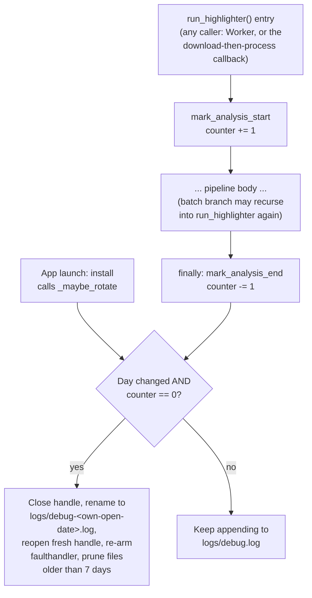

# Debug Log Rotation - Plan

## Goal Capsule

- **Objective:** Move the debug log into a dedicated folder and rotate it daily with a bounded retention window, without ever splitting a video analysis's log mid-run.
- **Product authority:** This document. No upstream brainstorm or requirements doc exists for this work.
- **Open blockers:** None. Two implementation-detail questions are deferred to planning (see Outstanding Questions) but do not block scoping.

---

## Product Contract

### Summary

Move the debug log into a dedicated `logs/` folder and rotate it daily (instead of once per app launch), keeping the last 7 days. Rotation defers whenever a video analysis is in progress, so a run spanning midnight is never split mid-log.

### Problem Frame

Today, `modules/debug_console.py` writes one `debug.log` at the app's data-directory root and rotates it exactly once per app launch, keeping a single previous session (`debug.prev.log`). A long-running app session can span many days without ever rotating, and a naive daily-timer rotation would risk cutting a video analysis's log in half if that analysis happens to be running when the day boundary passes — for example, an analysis starting at 10pm and finishing at 1am the next day would have its log split across two files under a plain calendar-day rotation, making the run hard to review afterward.

### Requirements

- R1. Debug logs live in a dedicated `logs/` folder instead of directly at the app's data-directory root.
- R2. The log rotates on a daily boundary instead of once per app launch.
- R3. Rotation never splits an in-progress video analysis's log — if a rotation is due while an analysis is running, it is deferred until that analysis finishes.
- R4. Rotated logs are retained for a bounded window of 7 days; anything older is deleted.
- R5. The new daily-rotation behavior replaces the current "keep exactly 1 previous session" behavior rather than running alongside it.

### Key Decisions

- **Extend the existing tee/rotate mechanism with one continuous, gated log, rather than a separate file per analysis run.** `debug_console.py` keeps writing to a single "current" log file at any given time; a per-run-file design was considered and set aside because it would fragment today's single continuous stream (which already spans multiple analyses within one app session) and would require the live log-viewer window to track a moving "current file" mid-session. Extending the existing gated-rotation shape is the smaller change and keeps the viewer's behavior unchanged.
- **The "analysis in progress" signal resets on every app launch (in-memory only, never persisted).** If the app crashes or is force-quit mid-analysis, a stale "in progress" flag must not survive into the next launch and permanently block future rotation.
- **Retention (7 days) is a fixed default, not a user-facing setting, for this scope.**

### Scope Boundaries

**Deferred for later:**
- Making the retention window configurable via a UI setting.

**Outside this plan:**
- Archiving or compressing expired logs — they are deleted, not preserved in another form.
- Giving each analysis run its own separate log file (the rejected alternative to the Key Decision above).

### Dependencies / Assumptions

- Assumes something in the pipeline's run lifecycle (start and end of a video analysis) can signal `debug_console.py` so it knows when it's safe to rotate — this signal does not exist today and is new work, not a reuse of existing plumbing.
- "Day boundary" is evaluated at safe checkpoints (app launch, end of each analysis run) rather than via a continuous background timer — exact semantics (calendar day vs. 24h-since-creation) deferred to planning.

### Outstanding Questions

**Deferred to Planning:**
- Exact mechanism for how `debug_console.py` learns "an analysis is in progress" (e.g., a module-level flag set/cleared by `pipeline.py`, vs. another signal) — `debug_console.py` is currently GUI-agnostic and works headless, and any mechanism should preserve that.
- Exact day-boundary check semantics: calendar day in local time vs. 24 hours since the current log file was created.

### Sources & Research

- `modules/debug_console.py:51-53` — `log_file_path()` returns `user_data_dir()/debug.log`, a single file at the data-directory root, not a subfolder.
- `modules/debug_console.py:110-135` — `install()` rotates once per app launch (renames `debug.log` to `debug.prev.log`, deleting any prior `.prev.log`), and explicitly skips rotation in multiprocessing children so they can't clobber the parent's live log.
- `main.py` — `Worker(QThread)` exposes `isRunning()`, giving the GUI layer an existing "is an analysis running" signal; `debug_console.py` itself has no equivalent today since it's designed to work independently of the GUI.
- `pipeline.py:346` — `run_highlighter()`, the single top-level pipeline function, has four exit points: batch return (`:424`), single-file success (`:2367`), cancellation via `RuntimeError` (`:2372`), and generic exception (`:2377`) — plus recursive self-calls per video inside the batch branch (`:392`).
- `run_highlighter()` has three independent call paths, two of which can run concurrently: `main.py:501` `Worker(QThread)` (manual "analyze" run); `main.py:2255` inside a `VideoHighlighterGUI` method invoked synchronously on `DownloadWorker`'s thread via its `process_callback` mechanism (`main.py:279`, `main.py:2224` explicitly comments "blocks the download worker thread by design") for "download then immediately process." Nothing guards against both running at once — `main.py:3513` only checks `self.worker.isRunning()` and `main.py:2132` only checks `self.download_worker.isRunning()`; neither checks the other.
- `modules/video_cache.py:600-613` `_cleanup_old_highlights()` — the repo's only existing file-pruning pattern (glob + sort by `mtime` + `.unlink()`), but count-based (LRU), not age-based; no `datetime.timedelta`-based deletion exists anywhere in the repo today.
- `modules/app_paths.py:28-32` `user_data_dir()` — no existing helper creates a subdirectory under it.

---

**Product Contract preservation:** Unchanged. Planning added the sections below without modifying any R-ID or existing Product Contract text.

## Planning Contract

### Key Technical Decisions

- **KTD1 — A reentrant counter, not a boolean, tracks "analysis in progress."** `run_highlighter()` recursively calls itself once per video during batch processing (`pipeline.py:392`). A boolean would be cleared by the first video's completion while the outer batch call is still running, prematurely unblocking rotation mid-batch. A counter (increment on start, decrement on end; "busy" = counter > 0) stays correct through nesting.
- **KTD2 — The `mark_analysis_start()`/`mark_analysis_end()` bracket is placed inside `run_highlighter()` itself, via `try`/`finally` around the whole function body, not at each caller — while the counter state itself lives as module-level state in `debug_console.py` (see U2).** Three independent code paths reach `run_highlighter()` (see the corrected caller list below); wrapping each call site would duplicate the bracket and risk drift. Wrapping the function body once covers all four known exit points (batch return, single-file success, cancellation, generic exception) and any future exit added later, without tracking each one individually.
- **KTD7 — `mark_analysis_end()`'s decrement, zero-check, and the decision to call `_maybe_rotate()` are one atomic operation under `debug_console.py`'s existing `_lock`.** Two callers can run `run_highlighter()` concurrently (see the corrected caller list below), so without atomicity a race is possible: thread A decrements to 0 and releases the lock, thread B's `mark_analysis_start()` increments to 1 for a new analysis, and thread A then rotates anyway — splitting thread B's in-progress log, exactly the failure R3 exists to prevent.
- **KTD8 — Mid-session rotation closes the open log handle before renaming, then reopens a fresh handle at the "current" path afterward, all under `_lock` and wrapped so a rotation failure can never propagate out of `run_highlighter()`'s `finally` block.** `debug_console.py`'s `_log_fh` is opened once in `install()` and held open for the rest of the process; `os.replace()` on a path with an open write handle in the same process raises `PermissionError: [WinError 32]` on Windows (confirmed by direct reproduction using the exact `open()` call `debug_console.py` uses). The existing per-launch swap in `install()` only avoids this because it renames *before* the handle is ever opened in that process — a precondition mid-session rotation does not share, since `_log_fh` is already open and being written to by `_Tee.write()`. `faulthandler.enable(file=_log_fh)` (bound once in `install()`) must be re-armed against the new handle after each mid-session rotation, or hard-crash diagnostics go stale for the rest of the session.
- **KTD3 — Rotation is checked at two safe checkpoints: app launch and whenever the counter returns to zero.** Not a continuous background timer — the app has no need for exact-midnight rotation, and checking only at launch and at outermost-call completion keeps the logic inside `debug_console.py` with no new scheduling primitive.
- **KTD4 — "Day boundary" is calendar day in local time, tracked via an in-memory module variable recording the date the current log file was opened into.** Consistent with the counter also being in-memory-only and reset each launch (per the Product Contract's crash-safety decision) — no persistence mechanism is introduced.
- **KTD5 — Retention pruning is modeled on `_cleanup_old_highlights()`'s shape (glob + `mtime`) but with an age cutoff instead of a count cutoff**, since no existing age-based deletion pattern exists in the repo to reuse directly.
- **KTD6 — Multiprocessing children never rotate or prune, matching `install()`'s existing `is_child` guard (`debug_console.py:120-124`).** Children only append; the rotation/prune decision belongs solely to the parent process that owns the counter.

### High-Level Technical Design

Rotation and the in-progress counter are independent mechanisms that only interact at the gate condition (`counter == 0`) — the counter never triggers rotation itself, it only unblocks a check that already fires at launch and at every outermost call completion.

---

## Implementation Units

### U1. Add a `logs/` subdirectory helper to `app_paths.py`

**Goal:** Give `debug_console.py` a place to put dated log files, following the existing `user_data_dir()`-relative resolution style.

**Requirements:** R1

**Dependencies:** none

**Files:**
- `modules/app_paths.py` (extends)
- `tests/test_app_paths_logs_dir.py` (new)

**Approach:** Add `logs_dir()` returning `os.path.join(user_data_dir(), "logs")`, creating the directory (`os.makedirs(..., exist_ok=True)`) if missing before returning it.

**Patterns to follow:** `app_paths.py:142-158` `config_path()` for the "resolve a user-writable path under `user_data_dir()`" style.

**Test scenarios:**
- Happy path: directory doesn't exist yet -> `logs_dir()` creates it and returns the path.
- Happy path: directory already exists -> returns the existing path without erroring.
- Regression: returned path is always under `user_data_dir()`.

**Verification:** New tests pass; `pytest -q` stays green.

---

### U2. Move the log into `logs/`, add the analysis-in-progress counter, and replace per-launch rotation with gated daily rotation + 7-day retention

**Goal:** `debug_console.py` writes into `logs/`, exposes `mark_analysis_start()`/`mark_analysis_end()`, and rotates daily (deferred while an analysis is in progress) instead of once per launch — replacing the current single-previous-file swap entirely.

**Requirements:** R1, R2, R3, R4, R5

**Dependencies:** U1

**Files:**
- `modules/debug_console.py` (extends)
- `tests/test_debug_console_rotation.py` (new)

**Approach:** Change `log_file_path()` (`debug_console.py:51-53`) to resolve under `logs_dir()`. Add module-level state guarded by the existing `_lock` (`debug_console.py:40`): an integer counter for in-progress analyses and a variable recording the current log file's open date. Add `mark_analysis_start()` (increments the counter) and `mark_analysis_end()`, which — under `_lock`, as a single atomic operation per KTD7 — decrements the counter and, only if it reached zero, calls the new `_maybe_rotate()`. Replace `install()`'s current per-launch swap (`debug_console.py:126-132`, the `os.remove(prev)` / `os.replace(path, prev)` pair) with a call to `_maybe_rotate()` before opening the file (this call has no open handle to worry about, same as today). `_maybe_rotate()`: skip entirely when `is_child` (mirroring the existing guard at `debug_console.py:120-124`) or when the counter is nonzero; otherwise, if the current log's recorded open-date is not today, perform the rotation per KTD8 — if `_log_fh` is currently open (the mid-session case, unlike the pre-open launch case), close it first, then rename the file to `logs/debug-<own-open-date>.log` (dated by its own open date, not today's date), open a fresh handle at the "current" path, and re-arm `faulthandler.enable(file=_log_fh)` against the new handle — then prune `logs/` for files older than 7 days. Wrap the whole rotation attempt in `try`/`except` so a failure (locked file, permission error) is logged and swallowed, never propagated — consistent with `install()`'s existing "read-only install dir" fallback at `debug_console.py:134-135`, and critical here because `_maybe_rotate()` is called from inside `run_highlighter()`'s `finally` block (KTD2) where an unhandled exception would mask the pipeline's real result or exception.

**Patterns to follow:** `video_cache.py:600-613` `_cleanup_old_highlights()`'s glob + `mtime`-sort shape, adapted to an age cutoff (`datetime.now() - timedelta(days=7)`) instead of a count cutoff. Existing `_lock` usage throughout `debug_console.py` for thread-safe state mutation.

**Test scenarios:**
- Happy path: `mark_analysis_start()` then `mark_analysis_end()` -> counter returns to 0 and a due rotation proceeds.
- Edge case: nested start/end (`start, start, end, end`) -> counter only reaches 0 after the second `end`; a rotation check that ran after the first `end` must not fire.
- Happy path: current log's open-date differs from today and counter is 0 -> rotates (renamed to its own dated filename) and prunes anything in `logs/` older than 7 days.
- Edge case: current log's open-date is today -> no rotation, keeps appending.
- Edge case: rotation is due but counter > 0 -> deferred, no rotation happens.
- Edge case: multiprocessing child (`is_child` true) -> never rotates or prunes regardless of counter or date, matching existing behavior.
- Regression: files within the 7-day window are not deleted; only files older than the cutoff are.
- Regression: a fresh process always starts with counter == 0 (no persistence across launches) — a prior crash mid-analysis cannot block a later launch's rotation.
- Critical path (covers KTD8): a mid-session rotation (an open `_log_fh`, not the pre-open launch case) closes the handle before renaming, successfully renames, reopens a fresh handle at the current path, and appends after rotation succeed without a `PermissionError`.
- Regression (covers KTD8): a rotation failure (simulate a locked/permission-denied rename) is logged and swallowed — `_maybe_rotate()` never raises out of `mark_analysis_end()`.
- Concurrency (covers KTD7): two threads calling `mark_analysis_start()`/`mark_analysis_end()` such that one's decrement-to-zero interleaves with the other's increment cannot both observe "safe to rotate" — the decrement, zero-check, and rotate-decision are atomic under `_lock`.

**Verification:** New tests pass; `pytest -q` stays green; manual smoke check that `logs/debug.log` is created on a fresh run and `debug.prev.log`/the old rotation behavior no longer appears.

---

### U3. Wire `mark_analysis_start`/`mark_analysis_end` into `run_highlighter()`

**Goal:** Every real pipeline run — from any caller, through every exit path — brackets itself with the in-progress counter, so rotation is deferred exactly while a video analysis is running, including when two callers run concurrently.

**Requirements:** R3

**Dependencies:** U2

**Files:**
- `pipeline.py` (extends `run_highlighter()`)
- `tests/test_run_highlighter_analysis_tracking.py` (new)

**Approach:** Wrap `run_highlighter()`'s body (`pipeline.py:346` onward) in `try`/`finally`: call `debug_console.mark_analysis_start()` immediately on entry, and `debug_console.mark_analysis_end()` in the `finally` block, so it fires on every exit path (batch return `:424`, single-file success `:2367`, cancellation `:2372`, generic exception `:2377`) without duplicating the bracket at each of the four `return` statements.

**Patterns to follow:** `tests/test_pipeline_legacy_imports.py` and `tests/test_progress_tracker_timing.py`'s per-file heavy-dependency shim pattern (`sys.modules.setdefault(name, MagicMock())`) for exercising `run_highlighter()` without real ML deps.

**Test scenarios:**
- Happy path: a single-video run calls `mark_analysis_start` once and `mark_analysis_end` once.
- Integration: a batch run (multiple videos, exercising the recursive per-video calls at `pipeline.py:392`) keeps the counter above zero for the whole batch — probe the counter mid-batch (e.g. via a mock inserted between videos) and confirm it has not returned to zero until the outer call completes. Covers KTD1.
- Regression: an exception raised partway through a run still calls `mark_analysis_end` (via `finally`), so the counter is never left elevated after a crash.
- Regression: the cancellation path (`RuntimeError` from `check_cancellation()`) still calls `mark_analysis_end`.
- Concurrency (covers KTD7): two concurrent `run_highlighter()` calls — modeling the real `Worker` (`main.py:501`) and `VideoHighlighterGUI`'s download-then-process callback (`main.py:2255`, invoked on `DownloadWorker`'s thread) running at once — keep the counter above zero for the entire union of both runs; rotation is deferred until both have finished, not just the first to finish.

**Verification:** New tests pass; `pytest -q` stays green; manual smoke check that a full pipeline run correctly defers a due rotation while it is in progress.

---

## Verification Contract

| Command | Applicability | Gate |
|---|---|---|
| `pytest -q` | All units | Full existing suite stays green, plus new tests for `app_paths.logs_dir`, `debug_console` rotation/counter behavior, and `run_highlighter` analysis tracking. |
| Manual smoke run | U2, U3 | Confirms `logs/debug.log` is created and populated on a real run, and that the old `debug.prev.log` per-launch swap no longer occurs. |

---

## Definition of Done

- **Global:** `pytest -q` is green, including all new test files. No new third-party dependency added.
- **U1:** `logs_dir()` reliably creates and returns a `logs/` path under `user_data_dir()`.
- **U2:** The log lives under `logs/`; the in-progress counter is reentrant-safe; rotation only fires at a safe checkpoint (launch or counter-zero) when the day has changed; retention prunes anything past 7 days and nothing else; multiprocessing children never rotate or prune; the old single-previous-file swap is fully replaced, not left running alongside the new behavior.
- **U3:** Every `run_highlighter()` exit path — including batch recursion, cancellation, and exceptions — correctly brackets the in-progress counter via `try`/`finally`.
- **Cleanup:** No leftover debug prints or scratch files from developing/testing the rotation logic.
