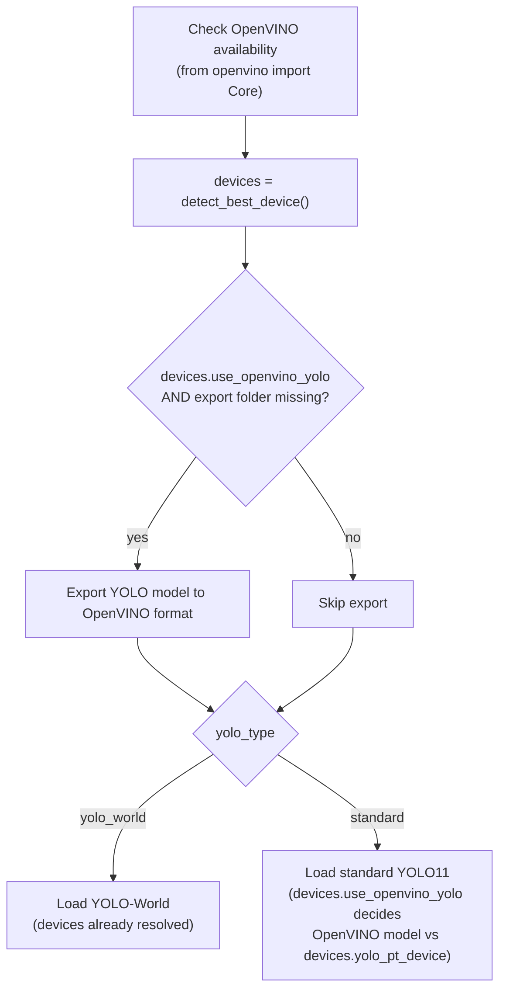

# Pipeline OpenVINO Device Detection Fix - Plan

## Goal Capsule

- **Objective:** Fix two bugs in `pipeline.py`'s YOLO/OpenVINO setup surfaced by a real pipeline run's log output — a broken OpenVINO availability check and an unconditional model export that wastes time on CUDA-active runs.
- **Product authority:** This document. No upstream brainstorm exists for this work.
- **Open blockers:** None.

---

## Product Contract

### Summary

`_run_highlighter_impl` (`pipeline.py`) checks OpenVINO availability and exports the YOLO model to OpenVINO format before deciding which backend to actually use. Both steps are broken: the availability check uses a removed import path and always fails, and the export always runs even when the run will use CUDA instead.

### Problem Frame

A real pipeline run's log (on a machine with a working CUDA GPU) showed `ℹ️ OpenVINO not available` immediately followed by a full YOLO-to-OpenVINO export, even though the very next log lines confirmed the run used `cuda:0` for YOLO inference and OpenVINO itself was genuinely available (`modules/device_utils.py`'s own probe reports `['CPU', 'GPU']` correctly). Both defects were traced to `pipeline.py:1023-1047`.

### Requirements

**`pipeline.py` fix (already implemented in the working tree — see U1):**
- R1. The OpenVINO device-availability check in `_run_highlighter_impl` shall import `Core` from the top-level `openvino` package (matching `modules/device_utils.py`'s working pattern), not the removed `openvino.runtime` submodule, so it accurately detects OpenVINO instead of always reporting "not available".
- R2. The YOLO-to-OpenVINO model export shall run only when the run will actually use the OpenVINO YOLO path (`devices.use_openvino_yolo` from `device_utils.detect_best_device()`), so a CUDA-active run does not pay for an export it never loads.
- R3. `detect_best_device()` shall be resolved once per YOLO setup pass in `_run_highlighter_impl` and reused for the export gate and both existing YOLO-loading branches, instead of being called again in each branch.

**Same import bug in sibling scripts (not yet fixed — see U2):**
- R4. `sorter.py`, `training/train_action_recognition.py`, and `model_training/intel/model.py` shall import `Core` from the top-level `openvino` package instead of the removed `openvino.runtime` submodule — the identical defect as R1, in three files outside `pipeline.py`.

**Regression coverage (not yet added — see U3):**
- R5. A test shall assert that `from openvino import Core` imports successfully (guards against reintroducing the `openvino.runtime` import), and that the YOLO export is skipped when `devices.use_openvino_yolo` is false, using a mocked `detect_best_device()` so no real GPU/OpenVINO hardware is required.

### Scope Boundaries

**Outside this plan:** any other `detect_best_device()` call site in `pipeline.py` (e.g. the transcript device pick at line 792, or the R3D backend decision later in the function) — those are separate, already-correct decision points untouched by this plan's changes; commit `5e81d17` (earlier this session) independently deduplicated a different redundant-`detect_best_device()`-call bug elsewhere in `_run_highlighter_impl`, establishing the same "resolve once, reuse" pattern this plan applies to the YOLO/OpenVINO block.

### Sources & Research

- `pipeline.py:1023-1047` — the broken availability check and unconditional export, confirmed via direct read.
- `modules/device_utils.py:104` — the correct `from openvino import Core` pattern already in use elsewhere in this codebase.
- Verified live: `from openvino.runtime import Core` raises `ModuleNotFoundError` under the pinned `openvino==2026.2.1`; `from openvino import Core` succeeds and reports `['CPU', 'GPU']`.
- Real pipeline run log (this session) confirming the export ran despite the subsequent YOLO load using `cuda:0`.

---

**Product Contract preservation:** N/A — no prior Product Contract exists for this fix; this document originates it.

## Planning Contract

### Key Technical Decisions

- **KTD1 — Fix the import, don't remove the check.** Switch `from openvino.runtime import Core` to `from openvino import Core`. `openvino==2026.2.1` (this repo's pin) removed the `openvino.runtime` submodule, so the old import always raised `ImportError` and silently misreported availability; the top-level import is the maintained path and already proven correct elsewhere in this codebase.
- **KTD2 — Gate the export on `devices.use_openvino_yolo`, don't remove it.** OpenVINO-path runs still need the exported model folder; only CUDA-active runs should skip the export. `detect_best_device()`'s existing `use_openvino_yolo` field is the single source of truth device_utils already provides for this decision.
- **KTD3 — Resolve `detect_best_device()` once and reuse it.** Call it once before the export gate; delete the two later re-calls in the YOLO-World and Standard YOLO loading branches, both of which already exist further down the same function and can consume the single resolved `devices` value. Avoids re-probing hardware three times in one function pass.
- **KTD4 — Fix the identical import in `sorter.py`, `training/train_action_recognition.py`, and `model_training/intel/model.py` as part of this plan, not a follow-up.** Doc review (feasibility) confirmed live that all three raise `ModuleNotFoundError` under the pinned `openvino==2026.2.1`. The fix is the exact one-line change already validated for R1, so folding it in costs nothing extra and closes a real, currently-broken import in code this repo ships. `sorter.py`'s import is unguarded at module scope (no try/except), so it fails harder than `pipeline.py`'s soft-fail did — worth fixing now rather than deferring.
- **KTD5 — Add a hardware-independent regression test instead of leaving R1-R3 untested.** Doc review (adversarial) noted the original bug was a silently-wrong branch that nothing caught for an unknown period, and the plan as first drafted repeated that pattern by declining all automated coverage. Both properties this plan fixes are testable without real GPU/OpenVINO hardware: the import succeeding is a plain Python import assertion, and the export-skip behavior is testable by mocking `detect_best_device()`'s return value.

### High-Level Technical Design

The three decisions compose into one straight-line sequence — resolve devices once, gate the export on it, then reuse the same value for whichever YOLO branch loads:

---

## Implementation Units

### U1. Fix OpenVINO import, gate the export, and dedupe device detection

**Goal:** Correct the OpenVINO availability check, make the YOLO export conditional on actually needing it, and resolve hardware once for the whole YOLO setup pass.

**Requirements:** R1, R2, R3

**Dependencies:** none

**Status:** Already implemented, uncommitted, in the working tree (`git diff -- pipeline.py` matches the Approach below exactly). This unit's remaining action is to verify and commit the existing change, not write new code.

**Files:**
- `pipeline.py` (modifies `_run_highlighter_impl`, lines ~1023-1090)

**Approach:** In the "Check OpenVINO devices" block, change the import to `from openvino import Core`. Immediately after that block, call `devices = detect_best_device(log_fn=log)` once. Change the export condition from `if not os.path.exists(openvino_model_folder):` to `if devices.use_openvino_yolo and not os.path.exists(openvino_model_folder):`. In the YOLO-World branch and the Standard YOLO11 branch below, remove their existing `devices = detect_best_device(log_fn=log)` calls and rely on the single `devices` value resolved above.

**Patterns to follow:** `modules/device_utils.py:104`'s `from openvino import Core` import; the earlier dedup of redundant `detect_best_device()` calls already done elsewhere in `_run_highlighter_impl` this session (single resolve, reused across branches).

**Test scenarios:** Covered by U3's regression test (R5) — see below.

**Verification:** `pytest -q` stays green. Manual smoke run on real hardware (see Verification Contract).

---

### U2. Fix the same `openvino.runtime` import in sibling scripts

**Goal:** Apply the identical import fix from U1 to the three other files that still use the removed `openvino.runtime` submodule.

**Requirements:** R4

**Dependencies:** none (independent of U1; same mechanical change)

**Files:**
- `sorter.py` (line 16)
- `training/train_action_recognition.py` (line 12)
- `model_training/intel/model.py` (line 13)

**Approach:** In each file, change `from openvino.runtime import Core` to `from openvino import Core`. No other changes — this is the same one-line fix as R1, applied three more times.

**Patterns to follow:** U1 / R1's fix in `pipeline.py`; `modules/device_utils.py:104`.

**Test scenarios:**
- Happy path: each file imports without raising `ModuleNotFoundError` under the pinned `openvino==2026.2.1`.
- `Test expectation: a single parametrized test covering all three files (plus pipeline.py) satisfies this -- see U3.`

**Verification:** `pytest -q` stays green; U3's import test covers all four files.

---

### U3. Add a hardware-independent regression test for the import and export-gate fix

**Goal:** Close the coverage gap that let the original bug ship undetected — assert the corrected import works and the export-gate branching is honored, without requiring real GPU/OpenVINO hardware.

**Requirements:** R5

**Dependencies:** U1, U2 (asserts on their corrected state)

**Files:**
- `tests/test_openvino_import.py` (new) — or add to an existing device/pipeline-adjacent test module if one better fits this repo's test layout.

**Approach:** Two test scenarios: (1) a parametrized test asserting `from openvino import Core` succeeds when imported fresh in each of `pipeline.py`, `sorter.py`, `training/train_action_recognition.py`, and `model_training/intel/model.py` (guards against reintroducing `openvino.runtime`); (2) a test that mocks `modules.device_utils.detect_best_device` to return a `DeviceInfo` with `use_openvino_yolo=False`, invokes the code path around `pipeline.py`'s export-gate block, and asserts the YOLO export function is never called. Follow this repo's existing shim pattern (`tests/conftest.py`) for any heavy imports the test setup would otherwise require.

**Patterns to follow:** `tests/conftest.py`'s heavy-dependency shim list; `tests/test_app_paths_config_override.py`'s `unittest.mock.patch` usage for a comparable mocked-dependency test shape.

**Test scenarios:**
- Happy path: fresh import of `openvino.Core` (not `openvino.runtime.Core`) succeeds in all four files listed above.
- Edge case: `devices.use_openvino_yolo=False` and the OpenVINO export folder does not exist → the export function is not invoked.
- Edge case: `devices.use_openvino_yolo=True` and the export folder does not exist → the export function is invoked (regression guard against over-correcting the gate).

**Verification:** New tests pass; `pytest -q` stays green including the full existing suite.

---

## Verification Contract

| Command | Applicability | Gate |
|---|---|---|
| `pytest -q` | U1, U2, U3 | Full suite (205 existing + U3's new tests) stays green. |
| Manual smoke run on real hardware | U1 | Correct OpenVINO devices reported (not "not available"); export skipped when CUDA is active and the OpenVINO folder doesn't yet exist. |

---

## Definition of Done

- **Global:** `pytest -q` is green.
- **U1:** `pipeline.py` imports `Core` from top-level `openvino`; the YOLO export is gated on `devices.use_openvino_yolo`; `detect_best_device()` is called once per YOLO setup pass and reused by both loading branches. (Already implemented — commit the existing working-tree diff.)
- **U2:** `sorter.py`, `training/train_action_recognition.py`, and `model_training/intel/model.py` all import `Core` from top-level `openvino`.
- **U3:** A new regression test asserts the corrected import across all four files and asserts the export-gate branching honors `devices.use_openvino_yolo`.
- **Cleanup:** No leftover debug prints or scratch files from developing this fix. `.gitignore` covers all `yolo11*.pt` / `yolo11*_openvino_model` / `yolov8*-worldv2.pt` model-export artifacts regardless of model size (already fixed).
