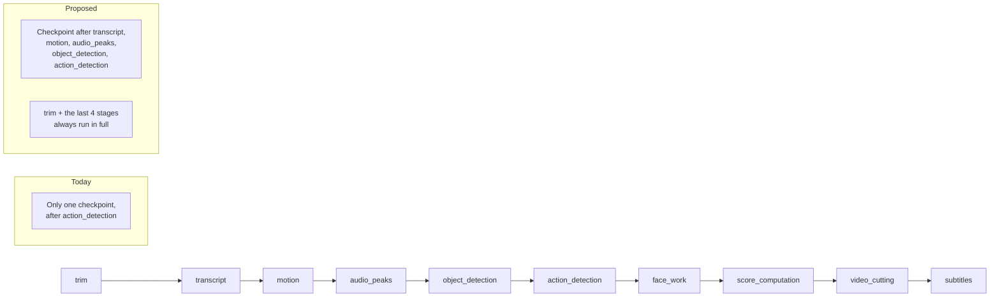
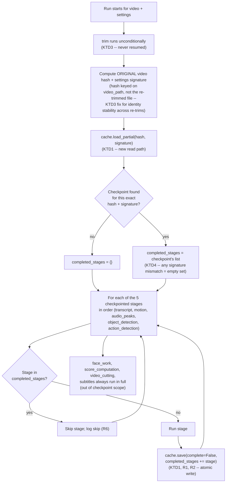

# Pipeline Checkpoint & Resume - Plan

## Goal Capsule

- **Objective:** Let a 6-7 hour, ~300GB video analysis run survive a power-off without losing all progress — automatically resume from the last fully-completed pipeline stage instead of reprocessing the whole file.
- **Product authority:** This document (brainstorm-originated), enriched by this planning pass.
- **Open blockers:** None.

---

## Product Contract

### Summary

Persist each of the 5 most expensive pipeline stages' results to disk as they complete, and automatically pick up from the last completed stage when the same video is re-run with the same settings — so a power interruption costs at most one in-progress stage, not the whole run. `face_work`, `score_computation`, `video_cutting`, and `subtitles` have no existing skip infrastructure today and always run in full on every run, checkpointed or not (see Scope Boundaries).

### Problem Frame

Large videos (6-7 hours, ~300GB) take that long to analyze, but the pipeline's only durable checkpoint today is a single all-or-nothing analysis cache written once, after both `object_detection` and `action_detection` finish (`pipeline.py:1507`). Everything before that point — `motion`, `audio_peaks`, `object_detection`, and `action_detection` itself — runs with no intermediate save. `object_detection` and `action_detection` are also the two stages most likely to dominate the runtime on a large file. A power-off during any of the analysis stages currently means starting the entire multi-hour run over from scratch.

### Requirements

**Checkpoint persistence:**
- R1. After each of the 5 checkpointed stages (`transcript`, `motion`, `audio_peaks`, `object_detection`, `action_detection`) completes, that stage's results shall be durably persisted to disk before the next stage begins.
- R2. Persistence shall use atomic writes so a power interruption mid-write never leaves a corrupted or unreadable checkpoint.

**Resume detection:**
- R3. Starting a run for a video whose exact video + settings combination matches an existing on-disk checkpoint shall automatically skip every stage already completed in that checkpoint.
- R4. A settings change relative to the checkpoint shall be treated as a fresh run, not a partial merge of old and new settings.
- R5. Batch runs shall resume per-video: one video's interruption shall not affect already-completed sibling videos in the same batch.

**Visibility:**
- R6. A resumed run shall log which stages were skipped due to resume, so its shorter duration is not confusing.

### Key Flows

- F1. **Fresh run (no existing checkpoint)**
  - **Trigger:** User starts analysis on a video with no matching on-disk checkpoint.
  - **Steps:** Every stage runs in order; each stage's result is persisted as it completes (R1, R2).
  - **Outcome:** Normal full run, now durably checkpointed along the way.
- F2. **Resumed run (after a power-off or Cancel)**
  - **Trigger:** User re-starts the same video with the same settings after an interruption.
  - **Steps:** App finds the matching checkpoint (R3), skips every stage already recorded complete, logs which ones were skipped (R6), and resumes execution at the first incomplete stage.
  - **Outcome:** Only the interrupted stage and everything after it re-runs.

### Key Decisions

- **Per-stage checkpoint granularity, not per-chunk.** Resume boundaries are pipeline stages, not sub-stage chunks. Simpler to build and reuses stage boundaries already instrumented in `pipeline.py`, but a crash deep into `object_detection` or `action_detection` — the two stages most likely to dominate runtime on a large file — still redoes that entire stage. Finer-grained recovery inside those two stages is deferred (see Scope Boundaries).
- **Checkpointing is scoped to the 5 stages that already have cache-skip infrastructure — `transcript`, `motion`, `audio_peaks`, `object_detection`, `action_detection`.** `face_work`, `score_computation`, `video_cutting`, and `subtitles` have no existing skip logic and no slot in the analysis-cache schema for what they'd need to persist (forbidden ranges, score arrays, selected segments, subtitle output); adding that is new design work, not a refactor of the existing gates, and is deferred (see Scope Boundaries). These 4 stages always run in full on every run — resumed or not — the same externally-visible behavior as `trim`, though for a different reason (no persistence infrastructure yet, not identity instability).
- **Extend the existing analysis cache rather than build a separate checkpoint mechanism.** Reuses the proven atomic-write primitive and the existing settings-hash used for staleness detection, instead of introducing a second, overlapping persistence concept.
- **Automatic resume, no explicit user action.** Re-running the same video with the same settings resumes silently; no separate "resume" command or interrupted-run browser.
- **Performance-improvement scope folded into checkpoint-stage prioritization, not a standalone deliverable.** The stages most worth checkpointing (`object_detection`, `action_detection`) are also the stages most worth speeding up on a large file; a general, independent performance-optimization pass is deferred.
- **The `trim` stage is excluded from resume and always re-runs when time-range is active.** Planning found its physical output has no atomic-write protection today and its cache-identity hash changes on every trim, so treating it as resumable risks trusting a corrupt file or never matching at all. Re-trimming is fast (stream copy) relative to the hours-long stages it protects.
- **Cancel gets identical resume treatment to a power-off.** Both leave the same on-disk partial state; building crash-vs-cancel detection adds complexity with no behavioral benefit. Since users will trigger Cancel far more often than an actual power-off, it becomes this feature's primary real-world exercise path.

### Acceptance Examples

- AE1. **Given** a video was fully checkpointed through `motion` and interrupted mid-`audio_peaks`, **when** the same video is re-run with identical settings, **then** `transcript` and `motion` are skipped (`trim` re-runs unconditionally per KTD3) and execution resumes at `audio_peaks`. Covers R3, R6.
- AE2. **Given** a video has a checkpoint through `object_detection`, **when** it is re-run with a different `yolo_model_size`, **then** the run starts fresh from `trim` rather than resuming, since the changed setting invalidates the cached analysis. Covers R4.
- AE3. **Given** a video using `use_time_range` was interrupted after `trim` completed, **when** the same video is re-run with identical settings, **then** `trim` re-runs anyway (never treated as resumable) while every other completed stage is still skipped normally. Covers R1, R3 (trim exception).
- AE4. **Given** a video has a checkpoint through `action_detection`, **when** it is re-run with only `MAX_DURATION` changed, **then** the run still resumes normally at `face_work` using the checkpointed `transcript`/`motion`/`audio_peaks`/`object_detection`/`action_detection` results, because `MAX_DURATION` only affects `score_computation`/`video_cutting` — stages that are out of checkpoint scope and always re-run in full with current settings regardless of resume. No settings-hash coverage is needed for the 4 always-full-rerun stages' settings, since they never participate in a skip decision. Covers R4.

### Scope Boundaries

**Deferred for later:**
- Checkpointing `face_work`, `score_computation`, `video_cutting`, and `subtitles`. None of these have existing cache-skip gates or a slot in the analysis-cache schema for their outputs today; adding that requires new persistence-schema design, not a refactor of the existing `using_cache` gates. These 4 stages always run in full on every run (resumed or not) until this is picked up. Revisit if their combined runtime proves painful enough on a large file to justify the design work.
- Sub-stage (per-chunk / frame-batch) checkpointing inside `object_detection` and `action_detection` — revisit if per-stage redo cost proves too painful in practice.
- A standalone UI for browsing or managing interrupted runs.
- A general, independent performance-optimization pass not tied to checkpoint-stage prioritization.
- Extending `build_analysis_cache_params()` to cover `face_work`/`score_computation`/`video_cutting`/`subtitles` settings (e.g. `MAX_DURATION`) — moot while those 4 stages are out of checkpoint scope entirely (they always re-run in full with current settings, so no invalidation logic can affect them either way). Revisit only if those stages are later brought into checkpoint scope.
- Orphaned checkpoint/temp-file cleanup or disk-space eviction — `VideoAnalysisCache` already accepts a `max_cache_size_mb` param but has no enforcement today; out of scope for this feature.

### Dependencies / Assumptions

- Assumes the existing `ProgressTracker.start_stage()`/`end_stage()` boundaries in `pipeline.py` for the 5 checkpointed stages (`transcript`, `motion`, `audio_peaks`, `object_detection`, `action_detection`) remain the checkpoint granularity. `trim`, `face_work`, `score_computation`, `video_cutting`, and `subtitles` are instrumented with the same `ProgressTracker` calls but are out of checkpoint scope (see Scope Boundaries) and always run in full.
- Assumes `modules/video_cache.py`'s `VideoAnalysisCache` / `CachedAnalysisData`, `atomic_write_json()`, and `build_analysis_cache_params()` continue to be the persistence and staleness-detection layer this feature extends.
- Assumes resume respects the existing `force_reprocess`/`use_cache` GUI flags identically to how they already gate the full-cache-hit path today — a partial checkpoint is bypassed under the same conditions a complete one would be.
- Assumes a pre-existing `OUTPUT_FILE` from a crashed attempt is always safe to overwrite on resume; its presence alone is never treated as "run already complete."

### Sources & Research

- `pipeline.py:547-2312` — `ProgressTracker.start_stage()`/`end_stage()` calls marking the 10 existing pipeline stage boundaries.
- `pipeline.py:1507` — the sole `cache.save(...)` call for the full analysis result, positioned after `action_detection` ends (`pipeline.py:1472`).
- `pipeline.py:640-782` — the existing `# ========== CACHE CHECK ==========` block, the natural insertion point for resume detection; already computes `analysis_params` (`:648-653`) and calls `cache.load(processed_video_path, params=analysis_params)` (`:676`).
- `pipeline.py:668,761,781,786,866,951,1104,1284,1457,1469,1475` — 11 sites tied to the single global `using_cache` boolean, in two groups verified against the current source: (a) `668` (`using_cache = False` init), `761` (`using_cache = True` inside the cache-hit branch), and `781` (`using_cache = 'cached_data' in locals() and cached_data is not None` recomputation) are assignment/derivation sites that are removed once `using_cache` is replaced by `completed_stages`, not conditionals to convert; (b) `786`, `866`, `1104` (`if not using_cache:` gates for `transcript`/`motion`/`object_detection`), `951` (`if using_cache:` for `audio_peaks`), and the `1284`/`1457`/`1469` three-way `if`/`elif`/`elif` chain for `action_detection` are the genuine gate sites that become per-stage `completed_stages` membership checks. `1475` (`if not using_cache and use_cache and not (...)`) gates the cache *save*, not a stage skip, and needs its own per-stage-save treatment per U3 rather than a membership-test conversion.
- `modules/video_cache.py:329-360` (`save()`), `:362-407` (`load()`), `:390-393` (the `cache_complete is not True` rejection gate), `:86-123` (`atomic_write_json()`), `:26-83` (`build_analysis_cache_params()`), `:287-294` (`_get_video_hash()`, path+size+mtime), `:310-320` (`_make_signature()` / per-video-per-settings cache path).
- `pipeline.py:382-442` — the batch loop; recurses through the public `run_highlighter()` wrapper per video (`:410`), confirming each video is already independently keyed/cached with no shared state across a batch.
- `main.py:3909`, `main.py:3939` — existing consumers of `cache.load()`'s current all-or-nothing return contract; the reason resume detection needs a new, separate read path rather than loosening `load()` itself.
- `pipeline.py:574,588` — `temp_trimmed_video` written directly by ffmpeg to its final path with no atomic-write protection; deleted only on a successful run (`pipeline.py:2339-2344`).
- `tests/test_run_highlighter_analysis_tracking.py:15-31`, `tests/test_progress_tracker_timing.py:18-29` — existing shim pattern for testing `pipeline.py`; all shim `modules.video_cache` to `MagicMock()`, so no existing test exercises real cache behavior — a new test needs a different approach (see U5).
- This session's earlier `feat-pipeline-perf-instrumentation` work (already shipped) added the `ProgressTracker` stage boundaries this feature builds on, and established the precedent that instrumentation/persistence failures should degrade gracefully rather than abort a run.

---

**Product Contract preservation:** Extended, not rewritten. R1-R6, F1-F2, and the original Key Decisions are unchanged. Added: one Key Decision (trim exclusion) and one clarifying Key Decision (Cancel-parity) surfaced during planning research; AE3 and AE4 supplementing the original AE1-AE2 to cover the trim/time-range case and the whole-vs-per-stage invalidation case; two Scope Boundaries items; two Dependencies/Assumptions items. The original two Outstanding Questions are resolved below (KTD1, KTD3) rather than carried forward unresolved.

## Planning Contract

### Key Technical Decisions

- **KTD1 — Add partial-state persistence via a new field and a new read path, not by loosening the existing cache contract.** Add `completed_stages: List[str]` to the cache_data dict and a `complete: bool = True` parameter to `VideoAnalysisCache.save()` (default preserves today's behavior for the two existing full-save call sites: `pipeline.py:1507` and the highlight-cache path). Add a new `load_partial()` method that returns on-disk data regardless of `cache_complete`, instead of changing `load()`'s existing `cache_complete is not True` rejection (`modules/video_cache.py:390-393`) — `load()`'s current all-or-nothing contract is relied on elsewhere (`main.py:3909`, `main.py:3939`) to mean "fully usable analysis," and loosening it would silently change that meaning for unrelated callers. Resolves the brainstorm's first Outstanding Question (partial-state shape).
- **KTD2 — Refactor the single global `using_cache` boolean into independent per-stage completion checks, scoped to the 5 checkpointed stages.** The `pipeline.py:668,761,781,786,866,951,1104,1284,1457,1469,1475` sites tied to `using_cache` (see Sources & Research for the verified assignment-vs-gate breakdown) become checks against `completed_stages` from KTD1's partial load; all 11 sites fall within the `transcript`→`action_detection` range (`pipeline.py:640-1518`), consistent with checkpointing being scoped to those 5 stages. This is the largest single implementation risk in this plan — bigger than "add more `save()` calls" — and requires verifying that stages consuming earlier stages' outputs (e.g. does `action_detection` read `object_detection`'s results from the in-memory `analysis_data` dict, or always re-derive them?) behave correctly when an earlier stage was skipped via resume rather than run this session.
- **KTD3 — Exclude `trim` from checkpointing; always re-run it when time-range is active. Key checkpoint identity on the original video, not the re-trimmed file.** `temp_trimmed_video` (`pipeline.py:574,588`) is written directly by ffmpeg with no atomic-write protection and is deleted only on success (`pipeline.py:2339-2344`), so a power-off mid-write can leave a truncated file at exactly the path a naive resume check would trust. Its identity hash (`_get_video_hash`, path+size+mtime) also changes on every re-trim (`pipeline.py:582-589` re-writes `temp_trimmed_video` with `ffmpeg -y`, producing a fresh mtime on a same-sized file), so a trimmed file can't stably represent "trim already done" across a crash/resume boundary. Since `trim` runs unconditionally before checkpoint identity is computed, this instability would otherwise propagate to the *whole* checkpoint if identity were keyed on `processed_video_path` (the trimmed file) as today's `cache.load(processed_video_path, ...)` call does at `pipeline.py:676` — every resumed `use_time_range` run would compute a hash that never matches the interrupted run's checkpoint, silently discarding all prior progress. `load_partial()` (KTD1) therefore keys identity on the **original** video's hash (`video_path`, not `processed_video_path`) plus the time-range parameters already captured in `analysis_params`, so identity stays stable across re-trims while still invalidating on a genuine source-file change. Re-trimming itself is a stream copy — cheap relative to the hours-long stages it protects. Resolves the brainstorm's second Outstanding Question (stage-dependent artifact re-validation) by making it moot for `trim` and closing the whole-checkpoint identity gap it would otherwise create.
- **KTD4 — Checkpoint invalidation on a settings change is whole-checkpoint (across the 5 checkpointed stages), not per-stage-scoped.** Reuses the existing single settings-hash (`build_analysis_cache_params()` / `_make_signature()`) as the one identity check for the checkpoint, matching R4's literal wording ("fresh run, not partial merge"). `build_analysis_cache_params()` doesn't cover `face_work`/`score_computation`/`video_cutting`/`subtitles` settings (e.g. `MAX_DURATION`) — this is not a gap to close: those 4 stages are out of checkpoint scope entirely (KTD2) and always re-run in full with current settings regardless of resume, so no settings-hash coverage can affect their correctness either way. Extending the hash to include their settings would only force unnecessary full reprocessing of the 5 expensive checkpointed stages whenever an unrelated downstream-only setting changes, with no correctness benefit — see AE4 and Scope Boundaries.
- **KTD5 — Resume respects the existing `force_reprocess`/`use_cache` flags identically to the current full-cache-hit path (`pipeline.py:656-657,671`).** No new toggle is introduced; a partial checkpoint is bypassed under the same conditions a complete one already is.
- **KTD6 — On resume, `OUTPUT_FILE` is always treated as regenerable.** Its mere existence is never read as "already done" — that determination comes from checkpoint state alone (`completed_stages` covering the 5 checkpointed stages).
- **KTD7 — Batch resume requires no batch-specific code.** The batch loop already recurses through the public `run_highlighter()` wrapper per video (`pipeline.py:410`) and each video is already independently keyed via its own path-based hash, so R5 falls out of KTD1-KTD4 applied per-video with zero additional plumbing.

### High-Level Technical Design

Resume detection slots into the existing cache-check block; the write side threads through the existing per-stage boundaries:

---

## Implementation Units

### U1. Add partial-state persistence to `VideoAnalysisCache`

**Goal:** Give the cache a way to durably record "stages X, Y, Z are done" and read that back, without changing what a fully-complete cache means to existing consumers.

**Requirements:** R1, R2

**Dependencies:** none

**Files:**
- `modules/video_cache.py` (modifies `VideoAnalysisCache.save()`, adds `load_partial()`)
- `tests/test_video_cache.py` (new)

**Approach:** Add `completed_stages: List[str]` to the dict `save()` writes, and a `complete: bool = True` parameter — when `False`, write `cache_complete: False` alongside the `completed_stages` list instead of today's unconditional `cache_complete: True` (`modules/video_cache.py:351`). Leave `load()` (`:362-407`) untouched. Add `load_partial(video_path, params) -> Optional[dict]` that performs the same hash (`_get_video_hash`) and signature (`_make_signature`) identity checks `load()` already does, but skips the `cache_complete` rejection — returning whatever `completed_stages` and partial data is on disk, or `None` on a hash/signature mismatch or missing file. Continue routing every write through `atomic_write_json()` (`:86-123`); no changes needed there per KTD1.

**Patterns to follow:** `VideoAnalysisCache.load()` (`modules/video_cache.py:362-407`) for the hash/signature identity-check structure `load_partial()` mirrors; `CachedAnalysisData.__init__`'s existing `.get(key, default)` defensive pattern (`:173-192`), which already tolerates missing keys.

**Test scenarios:**
- Happy path: `save(complete=False, completed_stages=["transcript", "motion"])` then `load_partial()` for the same video+params returns a dict with `completed_stages == ["transcript", "motion"]`. (`trim` never appears in `completed_stages` — it's excluded from checkpointing entirely per KTD3.)
- Happy path: `save()` with the default `complete=True` (no `completed_stages` override) still round-trips through `load()` exactly as before — regression guard on the two existing full-save call sites.
- Edge case: `load_partial()` on a video path with no cache file returns `None`.
- Edge case: `load_partial()` when the on-disk signature doesn't match the requested `params` returns `None` (covers R4 / KTD4 — the whole checkpoint is invisible to a resume check under different settings).
- Edge case: a fully-complete (`cache_complete: True`) cache is still readable via `load_partial()` too (e.g. all 5 checkpointed stages present) — resume detection shouldn't require a special case for "fully done."

**Verification:** New tests pass; `pytest -q` stays green.

---

### U2. Refactor per-stage `using_cache` gates in `pipeline.py`

**Goal:** Replace the single global "did the cache hit" boolean with independent per-stage skip decisions, so each stage can be skipped or run based on its own completion state.

**Requirements:** R1, R3

**Dependencies:** U1

**Files:**
- `pipeline.py` (modifies `_run_highlighter_impl`, the `using_cache`-related sites listed in Sources & Research)

**Approach:** Introduce a `completed_stages: set[str]` (from U1's `load_partial()`, or empty for a fresh run) available at each existing gate site. Per the verified breakdown in Sources & Research: remove the 3 assignment/derivation sites (`668`, `761`, `781`) once `using_cache` is replaced; replace the genuine gate sites (`786`, `866`, `951`, `1104`, and the `1284`/`1457`/`1469` chain) with the equivalent per-stage membership test (e.g. `if "motion" not in completed_stages:`); handle `1475`'s cache-save gate separately in U3, since it governs persistence, not a stage skip. Trace each gate site's surrounding code first to confirm what data a skipped stage needs to have available downstream (e.g. if `object_detection` is skipped via resume, its results must still be loaded from the partial checkpoint into the same in-memory shape `object_detection` would have produced) — this is the KTD2 risk area; do not assume today's `using_cache=True` full-cache-hit code path already does this correctly for every site, since today it's all-or-nothing and has never had to partially populate `analysis_data`. `face_work`, `score_computation`, `video_cutting`, and `subtitles` are out of scope for this unit (see Scope Boundaries) — they have no `using_cache` gate today and none is added.

**Patterns to follow:** The existing full-cache-hit branch's data-loading shape (wherever `using_cache=True` currently populates `analysis_data` from the loaded cache) is the template for what a per-stage skip needs to reproduce for that one stage.

**Test scenarios:**
- Happy path: with `completed_stages={"transcript","motion"}` and no other stages complete, verify (via the smallest reachable seam — likely a helper extracted from this logic, not full pipeline execution) that `audio_peaks` onward run while `transcript`/`motion` are skipped.
- Edge case: `completed_stages` containing a later stage but not an earlier one it depends on (e.g. `action_detection` complete but `object_detection` not) — should not occur under normal resume (stages complete in order), but verify the skip logic doesn't silently misbehave if it does; document the assumed invariant (stages complete in pipeline order) as a comment.
- Integration: a skipped stage's data is available in the same shape a freshly-run stage would have produced, for at least one stage with real downstream consumers (`object_detection` feeding `action_detection` is the clearest case per KTD2).

**Verification:** `pytest -q` stays green; manual smoke run (see Verification Contract) confirms a resumed run's final output matches a full fresh run's output for the same video+settings.

---

### U3. Wire incremental checkpoint-save calls after each stage

**Goal:** Make each stage's completion durable before the next stage starts, using the atomic write already proven by `atomic_write_json()`.

**Requirements:** R1, R2

**Dependencies:** U1, U2

**Files:**
- `pipeline.py` (adds a save call after each `progress.end_stage(...)` for the 5 checkpointed stages)

**Approach:** After each checkpointed stage's (`transcript`, `motion`, `audio_peaks`, `object_detection`, `action_detection`) `end_stage(...)` call, invoke `cache.save(complete=False, completed_stages=<accumulated list>)` via U1's extended API, wrapped in try/except so a checkpoint-write failure logs and continues rather than aborting the run — matching the established `ProgressTracker` posture (`end_stage` on an unmatched name is a no-op, never raises) that instrumentation/persistence must never be the reason a real run fails. `trim` is excluded per KTD3 (identity instability); `face_work`, `score_computation`, `video_cutting`, and `subtitles` are excluded per the scope decision (no persistence infrastructure) — neither gets a save call in this unit.

**Patterns to follow:** `pipeline.py:1507`'s existing `cache.save(...)` call site and its surrounding try/except shape (if any) as the closest precedent for a checkpoint write in this function.

**Test scenarios:**
- Happy path: after `transcript` completes, the on-disk checkpoint's `completed_stages` includes `"transcript"` and not stages after it.
- Error path: a simulated `cache.save()` exception after a stage completes is caught, logged, and does not stop the pipeline from continuing to the next stage.
- `Test expectation: full per-stage-save wiring inside _run_highlighter_impl is smoke-verified manually (see Verification Contract) given the function's size; the save/skip decision logic itself is unit-tested via U1/U2's extracted seams.`

**Verification:** `pytest -q` stays green; manual smoke run confirms checkpoint file grows with each stage during a real run.

---

### U4. Resume-detection wiring, trim exception, and skip logging

**Goal:** Tie U1-U3 together at the existing cache-check block: detect a matching partial checkpoint, always re-run `trim`, and log which stages were skipped.

**Requirements:** R3, R4, R5, R6

**Dependencies:** U1, U2, U3

**Files:**
- `pipeline.py` (modifies the `# ========== CACHE CHECK ==========` block, `pipeline.py:640-782`)

**Approach:** After `trim` runs (unconditionally, per KTD3) and `analysis_params` is built (`:648-653`, unchanged), call `cache.load_partial(video_path, params=analysis_params)` (U1) to get `completed_stages` for U2's per-stage gates — identity is keyed on the **original** `video_path`, not `processed_video_path`, so re-trimming doesn't change the checkpoint's identity hash (KTD3). Respect `force_reprocess`/`use_cache` identically to the existing full-cache-hit check (KTD5) — when either would bypass a complete cache, also bypass a partial one. Log each skipped stage by name at the point U2 skips it (R6), and log a one-line summary when any stages were skipped (e.g. count of stages skipped, count remaining). `OUTPUT_FILE` is not checked for pre-existence anywhere in this unit (KTD6) — it is only ever written by `video_cutting`, which is out of checkpoint scope and always runs.

**Patterns to follow:** The existing `# ========== CACHE CHECK ==========` block's structure (`pipeline.py:640-782`) for where this logic lives; existing `log(f"...")` call shapes throughout `_run_highlighter_impl` for the new skip-logging lines.

**Test scenarios:**
- Covers AE1: identical settings, checkpoint through `motion` → resumes at `audio_peaks`, with `transcript`/`motion` logged as skipped (`trim` re-runs unconditionally per KTD3 and is not logged as skipped).
- Covers AE2: `yolo_model_size` changed → full fresh run from `trim`, no stages skipped, no partial merge.
- Covers AE3: `use_time_range` active, checkpoint exists post-`trim` → `trim` re-runs anyway (producing a new `temp_trimmed_video` with a different mtime); checkpoint identity (keyed on `video_path`, not the re-trimmed file per KTD3) still matches, so all other completed stages skip normally.
- Covers AE4: only `MAX_DURATION` changed after a checkpoint through `action_detection` → settings signature for the 5 checkpointed stages is unaffected (`MAX_DURATION` isn't part of it), so the run resumes normally at `face_work`; `score_computation`/`video_cutting` pick up the new `MAX_DURATION` value on their always-full re-run regardless.
- Edge case: `force_reprocess=True` with a partial checkpoint present → full fresh run, checkpoint ignored, matching today's `force_reprocess` behavior for a complete cache.

**Verification:** New tests (in U5) covering AE1-AE4 pass; manual smoke run on real hardware confirms a Cancel mid-run followed by a same-settings re-run resumes correctly (KTD-Cancel-parity) and skip-logging is visible in the log output.

---

### U5. Regression tests for checkpoint/resume behavior

**Goal:** Prove U1-U4's behavior holds without needing to execute the full ~2000-line `_run_highlighter_impl`, following this repo's established pattern of testing extracted, dependency-light seams directly.

**Requirements:** R1-R6 (integration coverage across all of them)

**Dependencies:** U1, U2, U3, U4

**Files:**
- `tests/test_video_cache.py` (new, or extends U1's file — covers `save`/`load_partial` round-trips)
- `tests/test_checkpoint_resume.py` (new — covers the per-stage skip-decision logic and AE1-AE4, via whatever extracted helper U2/U4 exposes rather than running `_run_highlighter_impl` directly)

**Approach:** Do not reuse the existing `_shim_heavy_for_pipeline_import()` pattern that shims `modules.video_cache` to `MagicMock()` (`tests/test_run_highlighter_analysis_tracking.py:15-31` and siblings) — that pattern exists specifically to avoid exercising real cache behavior, which is exactly what this unit needs to test. `modules/video_cache.py` itself has zero heavy dependencies (stdlib only), so it and any resume-decision helper extracted from `pipeline.py` should be importable and testable without `pipeline.py`'s own heavy-import shim block at all.

**Patterns to follow:** `tests/test_progress_tracker_timing.py`'s style of testing a mechanism in isolation via direct instantiation, applied here to `VideoAnalysisCache` and the resume-decision logic rather than `ProgressTracker`.

**Test scenarios:**
- All scenarios listed under U1 and U2.
- Covers AE1-AE4 (see U4) at the decision-logic level (given a `completed_stages` set and a settings-signature match/mismatch, what does the skip decision produce) rather than via a full pipeline run.
- Batch independence (KTD7): a checkpoint written for video A's hash+signature does not affect video B's resume decision — mirrors the recursion-probe style in `tests/test_run_highlighter_analysis_tracking.py:76-112`.
- Cancel-parity (KTD-Cancel): a run interrupted via `check_cancellation()`'s `RuntimeError` path leaves the same on-disk `completed_stages` state as an equivalent-point crash, and a subsequent same-settings run resumes identically either way.
- Time-range identity stability (KTD3 fix): given a checkpoint saved under a `video_path`-keyed hash, simulate a re-trim producing a `temp_trimmed_video` with a different mtime than the one present when the checkpoint was written — `load_partial()` for the same `video_path` + `analysis_params` still returns the checkpoint (identity is unaffected by the re-trimmed file's mtime).

**Verification:** All new tests pass; `pytest -q` full suite stays green.

---

## Verification Contract

| Command | Applicability | Gate |
|---|---|---|
| `pytest -q` | U1-U5 | Full suite (existing + new tests) stays green. |
| Manual smoke run on real hardware: full run, then Cancel mid-run, then identical re-run | U2, U3, U4 | Resumed run's log shows the correct stages skipped (R6); final output file matches what an uninterrupted full run would have produced. |
| Manual smoke run: identical re-run with a checkpointed-stage setting changed (e.g. `yolo_model_size`) | U4 | Full fresh run from `trim`, no stages incorrectly skipped (R4, AE2). |
| Manual smoke run: identical re-run with only a downstream-only setting changed (e.g. `MAX_DURATION`) | U4 | Resumes normally at `face_work` using the checkpointed stages; `score_computation`/`video_cutting` reflect the new value on their always-full re-run (R4, AE4). |
| Manual smoke run: `use_time_range` video, Cancel after `trim`, re-run | U4 | `trim` re-runs; later completed stages (if any) still skip (R1 exception, AE3). |

---

## Definition of Done

- **Global:** `pytest -q` is green.
- **U1:** `VideoAnalysisCache.save()` accepts `complete`/`completed_stages`; `load_partial()` exists and round-trips correctly; existing full-save behavior is unchanged for current callers.
- **U2:** All genuine `using_cache` gate sites in `pipeline.py` (per the verified Sources & Research breakdown) use per-stage completion checks; the 3 assignment/derivation sites are removed; skipped stages' data is correctly available to downstream stages.
- **U3:** Every checkpointed stage (`transcript`, `motion`, `audio_peaks`, `object_detection`, `action_detection`) persists its completion atomically immediately after `end_stage()`; a save failure logs and does not abort the run.
- **U4:** Resume detection is wired into the existing cache-check block; checkpoint identity is keyed on the original `video_path` so re-trims don't break it; `trim`, `face_work`, `score_computation`, `video_cutting`, and `subtitles` always re-run; `force_reprocess`/`use_cache` bypass a partial checkpoint the same way they bypass a complete one; skipped stages are logged.
- **U5:** AE1-AE4 all have passing test coverage; batch and Cancel-parity behavior is verified by test, not just by architectural inference.
- **Cleanup:** No leftover debug prints or scratch files from developing this feature.
