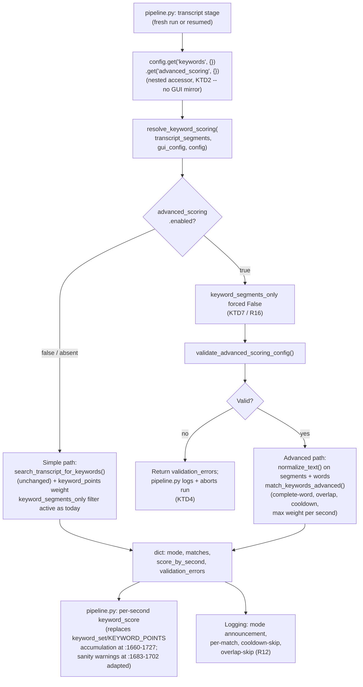

# Advanced Keyword Scoring - Plan

## Goal Capsule

- **Objective:** Let users assign different highlight-scoring weights to groups of transcript keywords (e.g. a "panic" phrase group worth more than a "reaction" phrase group), config-driven and opt-in, while today's flat single-score keyword matching stays the unchanged default.
- **Product authority:** This document (brainstorm-originated), enriched by this planning pass.
- **Open blockers:** None.

---

## Product Contract

### Summary

Add an opt-in `keywords.advanced_scoring` config section that, when enabled, scores transcript keyword matches by user-defined weighted groups instead of one flat score. Disabled (the default), everything behaves exactly as it does today. No GUI in this pass — configuration is YAML-only; GUI support is explicit follow-up work.

### Problem Frame

Today, transcript keyword scoring is a single flat value: every keyword in `transcript.search_keywords` that matches contributes `scoring.keyword_points` (`pipeline.py:1725-1727`), regardless of how strong a highlight signal that phrase actually is. A user wants "vou morrer" (panic-tier) to weigh more than "caraca" (mild-reaction-tier), which a flat score cannot express.

Two facts about the current implementation, confirmed by reading the code rather than assumed, materially shape this plan:

- `keywords.interesting` (a separate list also present in `config.yaml`) is **not read by scoring at all** — it is dead config, a byproduct of the GUI writing one input field's value into two YAML keys (`main.py:2910`, `:2916`). The list that actually drives both keyword-filtered transcript caching and keyword scoring is `transcript.search_keywords`. This plan's "simple mode" means today's `search_keywords`-driven behavior, not `keywords.interesting`.
- Matching is substring-based today (`modules/transcript.py:197-233`, `if keyword in text_lower`), not word-boundary-aware — `"morri"` matches inside `"cachorrinho"`. This plan intentionally does not change that for simple mode (see Scope Boundaries); complete-word matching is new behavior scoped to advanced mode only.

### Requirements

**Backward compatibility:**
- R1. When `keywords.advanced_scoring.enabled` is absent or `false`, keyword matching and scoring shall behave exactly as today: `search_keywords` drives both transcript-filtered caching and the flat `keyword_points` score per matched second, byte-for-byte unchanged.
- R2. `keywords.interesting` shall remain unused by matching or scoring; this feature neither reads nor writes it.

**Advanced mode configuration:**
- R3. Advanced mode is enabled only via `keywords.advanced_scoring.enabled: true`; default `false`.
- R4. When enabled, weight comes from user-defined groups (`id`, `weight`, `words`), unlimited in number, each scoring its own weight per match.
- R5. Groups are individually enable/disable-able (`enabled: true|false`, default `true`); disabled groups are preserved in config but never matched.

**Matching semantics:**
- R6. Advanced-mode matching uses complete words/phrases against normalized text (lowercase, accent-stripping, punctuation removal, whitespace-collapse, each independently configurable) — not substring matching.
- R7. When `prevent_overlapping_matches` is enabled (default `true`), the longest matching phrase at a given position wins; shorter overlapping matches at the same position are not also scored.
- R8. A `cooldown_seconds` window (default `5`) suppresses repeat scoring of the same normalized keyword within the window; different keywords score independently of each other's cooldowns.

**Scoring pipeline integration:**
- R9. When advanced mode is active, its weighted score replaces (not adds to) the flat `keyword_points` score for that run — exactly one keyword-scoring source is active at a time.
- R10. Multiple keyword matches, simple or advanced, continue to count as one `transcript` signal category for `min_signals_for_boost`, matching current behavior.
- R11. Every match carries metadata to reconstruct what matched and why: keyword, group (advanced only), weight, original/normalized text, timestamps, and `scoring_mode` (`"simple"` or `"advanced"`).
- R12. Runtime logs state the active scoring mode at the start of transcript scoring, and log each scored match, cooldown-skip, and overlap-skip.

**Validation:**
- R13. When advanced mode is enabled, its configuration is validated before use: non-empty unique group ids, numeric weight >= 0, at least one non-blank keyword per *enabled* group, no duplicate normalized keyword within or across groups. An invalid *enabled* configuration aborts the run with a clear error — it does not silently fall back to simple scoring.
- R14. When advanced mode is disabled, an invalid or incomplete `advanced_scoring` section never blocks simple-mode processing.

**Cache/resume correctness:**
- R15. Any advanced-scoring setting that changes *which seconds get matched* (group word-sets, normalization, overlap, cooldown) or the `enabled` flag itself is part of the analysis-cache signature (`build_analysis_cache_params()`), so a resumed pipeline run never silently reuses a checkpoint whose matches were computed under different matching settings. Pure scoring multipliers (group `weight`) are excluded, matching the existing `keyword_points` precedent (see Key Decisions).
- R16. When advanced mode is enabled, transcript caching shall not filter cached segments down to only `search_keywords` matches — advanced-mode group words that aren't also in `search_keywords` must still be present in the cached transcript for advanced matching to find them. Simple mode's existing `keyword_segments_only` filtering is unaffected.

### Key Decisions

- **Config-only in this pass; GUI is explicit follow-up work.** Confirmed with the user: ships the scoring engine, config schema, validation, and pipeline integration first; a GUI editor is a separate future feature once the engine is proven.
- **Advanced mode replaces the flat score, not adds to it.** One active keyword-scoring source per run keeps totals predictable and avoids double-counting a match under both systems.
- **Invalid *and enabled* config aborts the run rather than falling back to a default score.** Mirrors the repo's existing hard-gate pattern for unusable configuration (`pipeline.py:503-510`, "actions require objects but no objects configured" → `return None`). A silent fallback would let a broken group definition produce a plausible-looking but wrong score.
- **`keywords.interesting` stays untouched.** It is already dead config; this feature does not revive it or use it as a second source.
- **New engine lives in `modules/keyword_scoring.py`, zero heavy dependencies.** Follows this repo's established pattern (`modules/video_cache.py`, `modules/device_utils.py`, `modules/auto_segments.py`) of extracting pipeline logic into stdlib-only modules specifically so it is unit-testable without `pipeline.py`'s torch/cv2/ultralytics shim chain.
- **Advanced-scoring *matching-affecting* settings fold into `build_analysis_cache_params()`, whole-checkpoint granularity; group `weight` is excluded.** `scoring.keyword_points` (the simple-mode equivalent of a group's `weight`) is **not** part of today's signature — verified: it does not appear in `build_analysis_cache_params()` at all, and the function's own comment explains why ("points affect scoring, not analysis ... you can omit scoring params"). A group's `weight` is exactly this kind of pure scoring multiplier: it never changes which seconds match, only how much a match is worth. Only the `enabled` flag, group ids/word-sets, and the normalization/overlap/cooldown settings — everything that changes *which seconds match* — go in the signature, following the `scene_points`-style precedent (`modules/video_cache.py:26-91`, lines 74-77) for the right reason: without this exclusion, a user tuning weight values for calibration would force a full recompute of all 5 checkpointed stages (including motion/audio/object/action detection, which have nothing to do with keywords) on every tweak, undermining the just-shipped checkpoint/resume feature's value for this exact workflow.
- **Advanced mode disables `keyword_segments_only` transcript-caching filtering.** Today, whenever `search_keywords` is non-empty, cached transcript segments are filtered down to only those matching `search_keywords` (`pipeline.py:695`, `:255-264`), and cache-reuse compatibility is judged by a `search_keywords`-only superset check (`pipeline.py:785-789`). Since advanced groups can define words independent of `search_keywords` (R4), leaving this filter active would silently starve advanced matching of segments containing only advanced-mode-only words on any cached/resumed run. Forcing full-transcript caching whenever `keywords.advanced_scoring.enabled` is `true` sidesteps this without touching the filter's existing logic or `search_keywords`' own behavior (R16).
- **Simple mode's matches also carry `scoring_mode`/weight metadata via a thin wrapper**, not a reimplementation — `search_transcript_for_keywords` (`modules/transcript.py:197-233`) keeps doing the actual matching for simple mode; a wrapper only shapes its output to satisfy R11.
- **No existing normalization helper to reuse — build it from stdlib only.** `modules/transcript.py` currently does only `.lower().strip()`; no accent-stripping or punctuation removal exists anywhere in the repo. Use `unicodedata.normalize("NFKD", ...)` plus combining-mark filtering for accent-stripping (handles the Portuguese examples in scope) rather than adding a new dependency like `unidecode`.
- **When multiple different-weight matches land in the same second, the second's score is the maximum weight among them, not a sum.** Today's simple mode already collapses per-second matches into presence/absence (one `keyword_points` contribution regardless of match count, via a `set`) — the natural weighted generalization of "one contribution per second" is "the strongest match's weight," not summing every match. Summing would let a phrase-dense second produce runaway scores unrelated to any single group's calibrated weight.

### Scope Boundaries

**Deferred for later:**
- GUI support (toggle, group editor, live test-transcript tool, drag-reorder, duplicate-validation UI) — explicit follow-up feature once the YAML-driven engine is proven.
- Changing `search_keywords`' own definition, matching logic, or filtering behavior in simple mode — untouched. The one exception, R16, is narrow: whether the existing `keyword_segments_only` filter applies at all becomes conditional on advanced mode being enabled, so advanced-mode group words aren't starved by a filter scoped to a different keyword list. The filter's own logic and simple mode's behavior are unchanged.
- Cleaning up or reviving `keywords.interesting` — left exactly as-is (dead config).
- Complete-word matching for **simple mode**. Simple mode keeps today's substring matching (including its known false-positive risk, e.g. `"morri"` inside `"cachorrinho"`) exactly as-is, per R1's backward-compatibility requirement — only advanced mode gets word-boundary-aware matching.

### Dependencies / Assumptions

- Assumes `search_transcript_for_keywords` (`modules/transcript.py:197-233`) remains the matching function for simple mode, unmodified.
- Assumes `build_analysis_cache_params()` (`modules/video_cache.py:26-91`) remains the single settings-signature function this session's checkpoint/resume feature relies on; this plan extends it rather than introducing a parallel signature mechanism.
- Assumes the `transcript` pipeline stage (one of the 5 checkpointed stages from the just-shipped checkpoint/resume feature) remains the point where keyword matching and scoring occur.

### Sources & Research

- `modules/transcript.py:197-233` — `search_transcript_for_keywords`, the current matching function: substring-based, first-keyword-wins per segment, returns `list[dict]` with `keyword`/`main_segment`/`context_segments`/`start`/`end`.
- `pipeline.py:919-953` — two call sites for `search_transcript_for_keywords` (fresh transcript run, and resumed/cached-transcript path), currently used for logging only.
- `pipeline.py:1649-1667` — where `SEARCH_KEYWORDS`/`KEYWORD_POINTS` are read via the repo's `gui_config.get(x, config.get(x, default))` fallback chain, and where matched seconds collapse into a `keyword_set`. This flat single-level `.get()` pattern works today only because `gui_config` (fully flat, built by `main.py`'s `build_pipeline_config()`) always supplies these keys — `config.get(x, default)` is effectively dead code in that chain. `keywords.advanced_scoring` has no GUI in this pass, so it will never appear in `gui_config`; it must be read via the *other* existing pattern instead (see `pipeline.py:477` below).
- `pipeline.py:477` — `config.get("highlights", {}).get("max_duration", 420)`, the correct nested two-step accessor this repo already uses for config.yaml-only values with no GUI mirror. `keywords.advanced_scoring` needs this pattern (`config.get("keywords", {}).get("advanced_scoring", {})`), not the flat pattern above.
- `pipeline.py:1683-1702` — two sanity-warning blocks (`keyword_points > 0` but no `search_keywords`; `search_keywords` configured but no matches found) and a `total_possible` sum, all referencing the flat `KEYWORD_POINTS`/`SEARCH_KEYWORDS`/`keyword_matches` variables directly. U3 must adapt or gate these for advanced mode so they don't produce misleading warnings.
- `pipeline.py:1725-1727` — `keyword_score[sec] += KEYWORD_POINTS`, the actual flat-score accumulation this plan's advanced path replaces when enabled.
- `pipeline.py:1808-1818` (and duplicated debug logic at `:2244-2254`) — multi-signal boost logic; keyword presence is already one boolean among 6 signal categories, confirming R10 describes existing behavior to preserve, not new behavior to build.
- `pipeline.py:503-510` — existing hard-gate precedent ("actions require objects but no objects configured" → log error, `return None`) this plan's R13 abort-on-invalid-and-enabled behavior mirrors.
- `pipeline.py:695`, `:255-264` — `keyword_segments_only` transcript-cache filtering, gated purely on `search_keywords`; `pipeline.py:785-789`'s cache-compatibility superset check is likewise `search_keywords`-only. Neither is aware of advanced-mode group words, motivating R16.
- `main.py:2910`, `:2916` — the GUI's single "search keywords" input field writing the same value into both `keywords.interesting` and `transcript.search_keywords`, confirming `keywords.interesting` is not an independent list.
- `config/config.yaml:116-125` — existing top-level `advanced:` section (a flat namespaced power-user block), the closest existing "advanced options" shape in this config, though this feature nests under `keywords:` per the user's original schema rather than the top-level block (different concern: keyword scoring, not device/backend tuning).
- `modules/video_cache.py:26-91` — `build_analysis_cache_params()`, including the `search_keywords` sorted-lowercased precedent (line 51) and the zero-value-gating-fields comment (lines 74-77) this plan's R15 follows.
- `modules/auto_segments.py:70-105` — `cluster_points(timestamps, max_gap, min_pad, max_pad)`, the closest existing gap-based grouping pattern in this codebase; a loose conceptual analog for cooldown windows, not a literal reuse target (cooldown suppresses by elapsed time since last same-keyword match, not spatial clustering).
- `tests/test_video_cache.py`, `tests/test_progress_tracker_timing.py`, `tests/test_cluster_points.py` — this repo's established convention of testing stdlib-only `modules/` extractions directly, without pipeline.py's heavy shim chain.
- No config validation layer exists anywhere in this repo today (all 6 `yaml.safe_load` call sites are bare loads with no schema) — this plan introduces the first one, scoped narrowly to `keywords.advanced_scoring`.
- No `docs/solutions/` entries exist yet in this repo; none were found relevant. The settings-signature-coverage risk this plan's R15 addresses was independently confirmed as a real, already-once-caught defect class this session (the checkpoint/resume feature's own code review found and fixed a missing-signature-field bug for `scene_points`/`motion_event_points`/`motion_peak_points`).

---

**Product Contract preservation:** Extended from the confirmed brainstorm scope, not rewritten. R1-R14, the core Key Decisions, and Scope Boundaries reflect exactly what was confirmed in dialogue (config-only, simple mode unchanged and reads `search_keywords` not `keywords.interesting`, GUI deferred). Added during planning: R15's cache-signature requirement and R16's transcript-caching-interaction requirement (both correctness gaps invisible without knowledge of the just-shipped checkpoint/resume feature and the existing `keyword_segments_only` filter), plus their supporting Key Decisions.

## Planning Contract

### Key Technical Decisions

- **KTD1 — New module, not new code in `pipeline.py` or `modules/transcript.py`.** `modules/keyword_scoring.py` (new, zero heavy deps) houses normalization, validation, advanced matching, and a single pipeline-facing entry point. `pipeline.py` calls into it rather than growing its own ~2000-line function further. Mirrors this session's `resolve_completed_stages()` precedent (`modules/video_cache.py`) — small, pure, testable functions extracted from pipeline.py's core loop.
- **KTD2 — Single resolver entry point.** `resolve_keyword_scoring(transcript_segments, gui_config, config) -> dict` (with keys `mode`, `matches`, `score_by_second`, `validation_errors`) is the *only* function `pipeline.py` calls for keyword scoring. It internally dispatches to simple or advanced matching based on `keywords.advanced_scoring.enabled`, which it reads via `config.get("keywords", {}).get("advanced_scoring", {})` — the nested two-step accessor this repo already uses for config.yaml-only values with no GUI mirror (`pipeline.py:477`), not the flat `gui_config.get(x, config.get(x, default))` pattern used for GUI-backed settings like `keyword_points` (that pattern would never find a nested nothing-in-`gui_config` key). This replaces both existing call sites (`pipeline.py:919-953` for matching/logging, `:1649-1727` for scoring) with one call, closing the gap where matching and scoring are currently computed separately from the same source and could drift.
- **KTD3 — Simple mode wraps, not reimplements, `search_transcript_for_keywords`.** The resolver's simple-mode path calls the existing function unmodified and maps its output into the same match-metadata shape advanced mode produces (`scoring_mode: "simple"`, `weight: keyword_points`), satisfying R11 without touching R1's byte-for-byte-unchanged guarantee.
- **KTD4 — Validation runs only when `enabled: true`, at the point the resolver is called (run time), not at config-load time.** No config-load-time validation layer exists anywhere in this repo to plug into (verified: all `yaml.safe_load` call sites are bare). Adding one here, scoped to this one section, avoids inventing generic config-schema infrastructure this plan doesn't need. On failure with `enabled: true`, `resolve_keyword_scoring` returns a non-empty `validation_errors` list; `pipeline.py` logs it and aborts the run (mirrors `pipeline.py:503-510`'s existing hard-gate shape). `enabled: false` skips validation entirely regardless of what the rest of the section contains (R14).
- **KTD5 — Cache-signature coverage via `build_analysis_cache_params()`, whole-checkpoint granularity, weight excluded.** Add a normalized, sorted representation of the active `keywords.advanced_scoring` config to the dict `build_analysis_cache_params()` returns — the `enabled` flag; when enabled, sorted group ids with their normalized word-sets (not weights) and the normalization/overlap/cooldown settings — following the `search_keywords` sorted-lowercased precedent (`modules/video_cache.py:51`). Group `weight` is deliberately excluded (see Key Decisions: it's a pure scoring multiplier, matching how `keyword_points` itself is already excluded today). Since `transcript` is one of the 5 `CHECKPOINTED_STAGES` this session's checkpoint/resume feature added, any signature change to a *match-affecting* setting already invalidates the whole checkpoint (KTD4 of that feature) — this plan reuses that existing mechanism rather than building stage-scoped invalidation, while weight-only tuning correctly leaves the signature untouched.
- **KTD6 — Accent-stripping via stdlib `unicodedata`, no new dependency.** `unicodedata.normalize("NFKD", text)` followed by filtering out combining-mark characters (category `Mn`) handles the Portuguese accent-stripping case in the Product Contract's examples (`"não"` → `"nao"`) without adding `unidecode` or any other dependency to a repo that currently has none for this purpose.
- **KTD7 — Force full-transcript caching when advanced mode is enabled.** `pipeline.py`'s existing `keyword_segments_only` computation (`pipeline.py:695`) becomes `bool(SEARCH_KEYWORDS and USE_TRANSCRIPT and not advanced_scoring_enabled)` — the one-line change that implements R16. No change to the filter's own logic (`pipeline.py:255-264`) or the cache-compatibility superset check (`:785-789`); both stay `search_keywords`-only and simply never fire while advanced mode is on.

### High-Level Technical Design

---

## Implementation Units

### U1. `modules/keyword_scoring.py` — matching, normalization, and scoring engine

**Goal:** A pure, dependency-light module providing normalization, advanced-config validation, advanced matching (complete-word, overlap, cooldown), and the single `resolve_keyword_scoring()` entry point pipeline.py will call.

**Requirements:** R3, R4, R5, R6, R7, R8, R9, R10, R11, R13, R14

**Dependencies:** none

**Files:**
- `modules/keyword_scoring.py` (new)
- `tests/test_keyword_scoring.py` (new)

**Approach:** Implement as independent, composable functions rather than a class, matching this repo's `modules/video_cache.py`/`modules/auto_segments.py` style:
- `normalize_text(text, *, lowercase=True, remove_accents=True, remove_punctuation=True, collapse_whitespace=True) -> str` — stdlib-only (KTD6).
- `validate_advanced_scoring_config(advanced_scoring: dict) -> list[str]` — returns human-readable error strings; empty list means valid. Checks per R13: unique non-empty group ids, numeric weight >= 0, at least one non-blank keyword per enabled group, no duplicate normalized keyword within or across groups.
- `match_keywords_advanced(transcript_segments, advanced_scoring: dict) -> list[dict]` — normalizes segment text and configured words once, finds complete-word/phrase matches, applies overlap prevention (longest-match-wins at a given position, R7) and cooldown suppression (R8) across the whole transcript in chronological order. Each result dict matches the R11 metadata shape with `scoring_mode: "advanced"`.
- `match_keywords_simple(transcript_segments, search_keywords, keyword_points) -> list[dict]` — thin wrapper around the existing `modules.transcript.search_transcript_for_keywords`, reshaping its output to the same R11 metadata shape with `scoring_mode: "simple"`, `weight: keyword_points` (KTD3). Does not alter the underlying matching algorithm.
- `resolve_keyword_scoring(transcript_segments, gui_config, config) -> dict` — the KTD2 entry point. Reads `keywords.advanced_scoring` via `config.get("keywords", {}).get("advanced_scoring", {})` — the nested two-step accessor this repo uses for config.yaml-only values with no GUI mirror (`pipeline.py:477`), **not** the flat `gui_config.get(x, config.get(x, default))` pattern (`pipeline.py:1649-1659`), which only works for settings `gui_config` actually supplies and would never find this nested, GUI-absent key. Dispatches to simple or advanced, and returns `{"mode": "simple"|"advanced", "matches": [...], "score_by_second": {sec: weight}, "validation_errors": [...]}`. `score_by_second` collapses matches per unique second to the **maximum** weight among matches in that second (not a sum — see Key Decisions), mirroring today's presence-only dedup at `pipeline.py:1660-1667` generalized to weighted matches.

**Patterns to follow:** `modules/video_cache.py`'s `resolve_completed_stages()` for the "small pure function returning a decision, tested in isolation" shape; `modules/auto_segments.py:70-105`'s `cluster_points()` for the general shape of a gap/window-based grouping pass (cooldown is time-since-last-match, not spatial clustering, so adapt the concept, don't port the function).

**Test scenarios:**
- Happy path: `normalize_text("AI, NÃO!")` → `"ai nao"` with all four normalization flags on; each flag independently toggleable and verified off.
- Happy path: `match_keywords_advanced` with two groups (weights 6 and 15) correctly attributes each match to its group and weight.
- Edge case: complete-word matching — `"morri"` matches `"eu morri"`, does not match `"cachorrinho"`.
- Edge case: overlap — configured `"meu deus"` and `"ai meu deus"`, transcript contains `"ai meu deus"`, `prevent_overlapping_matches: true` → only the longer phrase scores.
- Edge case: cooldown — the same normalized keyword appearing 4 times within `cooldown_seconds` scores once; a *different* keyword in the same window scores independently.
- Edge case: same-second, different-group matches — a reaction-tier (weight 6) and a panic-tier (weight 15) match in the same second resolve to `score_by_second[sec] == 15` (max), not `21` (sum).
- Error path: `validate_advanced_scoring_config` rejects duplicate group ids, negative weight, empty-keyword *enabled* groups, and duplicate normalized keywords within one group and across two groups — one scenario each. A disabled group with no keywords does not trigger a rejection (R13's "enabled group" scope).
- Error path: `resolve_keyword_scoring` with `enabled: true` and an invalid config returns non-empty `validation_errors` and an empty match list (no partial processing).
- Integration: `resolve_keyword_scoring` with `enabled: false` (or the key absent) and a syntactically broken `advanced_scoring` section still returns a valid simple-mode result (R14) — invalid-but-disabled never blocks.
- Integration: `resolve_keyword_scoring`'s simple-mode output is behaviorally identical (same matched seconds, same total weight) to directly calling `search_transcript_for_keywords` + accumulating `keyword_points`, proving KTD3's wrapper doesn't change simple-mode results.

**Verification:** New tests pass; `pytest -q` stays green.

---

### U2. Fold `keywords.advanced_scoring` into the analysis-cache signature

**Goal:** Ensure a settings change to advanced scoring invalidates cached/checkpointed analysis, so a resumed run never silently reuses stale keyword-scoring data.

**Requirements:** R15

**Dependencies:** U1 (needs the config shape U1 validates/consumes to build a stable, sorted representation)

**Files:**
- `modules/video_cache.py` (modifies `build_analysis_cache_params()`)

**Approach:** Add a new key to the dict `build_analysis_cache_params()` returns — a normalized, JSON-stable representation of `keywords.advanced_scoring` (the `enabled` flag; when `true`, sorted group ids with their sorted normalized word lists, plus the normalization/overlap/cooldown settings). **Deliberately omit group `weight`** (KTD5) — it never changes which seconds match. Follow the existing `"search_keywords": sorted([str(k).lower() for k in search_keywords])` precedent (`modules/video_cache.py:51`) for stability (sorted, not insertion-order-dependent, so reordering groups/words in YAML doesn't spuriously invalidate the cache). Whole-checkpoint invalidation, not stage-scoped (KTD5) — no change needed to `CHECKPOINTED_STAGES` or `resolve_completed_stages()`.

**Patterns to follow:** `modules/video_cache.py:26-91`'s existing field-by-field construction, in particular the zero-value-gating-fields precedent at lines 74-77 (the comment explaining *why* `scene_points`/`motion_event_points`/`motion_peak_points` must be signature-covered) as the direct model for why `advanced_scoring.enabled` and its group contents must be covered too.

**Test scenarios:**
- Happy path: two calls to `build_analysis_cache_params()` differing only in `keywords.advanced_scoring.enabled` (`false` vs `true`, same groups) produce different params dicts.
- Happy path: two calls differing only in one group's *word list* produce different params dicts (a match-affecting change).
- Edge case: two calls differing **only** in one group's `weight` produce the **identical** params dict — weight-only tuning must not force a checkpoint recompute (R15, KTD5).
- Edge case: two calls with the same groups but different YAML ordering (group order swapped, word order swapped within a group) produce **identical** params dicts (sorted-representation stability).
- Edge case: `advanced_scoring` absent entirely vs present-but-`enabled: false` — both produce the same params dict (disabled state is canonical regardless of leftover group content), consistent with R14.

**Verification:** New tests pass; `pytest -q` stays green.

---

### U3. Wire `pipeline.py` to the new resolver

**Goal:** Replace pipeline.py's existing two-call-site keyword matching/scoring (logging-only match lookup, plus separately-computed `keyword_set`/`KEYWORD_POINTS` accumulation) with one call to `resolve_keyword_scoring()`, surface R12's logging and R13's abort-on-invalid behavior, and fix the two interaction points advanced mode breaks if left as-is (R16's caching filter, and the existing sanity-warning/`total_possible` logic).

**Requirements:** R1, R2, R9, R10, R12, R13, R14, R16

**Dependencies:** U1, U2

**Files:**
- `pipeline.py` (modifies the transcript-stage match/log call sites around `:919-953`, the `keyword_segments_only` computation around `:695`, the scoring accumulation around `:1649-1727`, and the sanity-warning/`total_possible` block around `:1683-1702`)

**Approach:** Replace the existing `search_transcript_for_keywords(...)` calls at both the fresh-run and cached-transcript-resume points, and the later `keyword_set`/`KEYWORD_POINTS` accumulation, with a single `resolve_keyword_scoring(transcript_segments, gui_config, config)` call whose result feeds both the existing log lines and the per-second score map used by the scoring/selection logic further down the function. Read `keywords.advanced_scoring` via `config.get("keywords", {}).get("advanced_scoring", {})` (the nested config.yaml-only accessor, not the flat `gui_config`-fallback pattern used for GUI-backed settings — see KTD2). On `mode == "advanced"` with non-empty `validation_errors`, log each error and `return None` (mirroring `pipeline.py:503-510`'s existing hard-gate shape) — do not proceed with partial or fallback scoring. Log the active mode once at the start of transcript scoring (R12), and log each match/cooldown-skip/overlap-skip using the `matches` list's metadata. Change `keyword_segments_only`'s computation (`pipeline.py:695`) to also require advanced mode be disabled (KTD7/R16), so cached transcripts aren't filtered down to only `search_keywords` matches while advanced mode is active. Adapt the sanity-warning and `total_possible` block (`pipeline.py:1683-1702`) to read from the resolver's `mode`/`score_by_second` output instead of the raw `KEYWORD_POINTS`/`SEARCH_KEYWORDS`/`keyword_matches` variables, so warnings stay accurate under advanced mode (e.g. don't warn "no search keywords configured" when advanced groups are the active source). Trace the exact current call sites carefully before editing — matching and scoring are today computed at two different points in the function from the same underlying source, and the resolver must supply both without changing *when* each currently fires relative to other stages.

**Patterns to follow:** `pipeline.py:503-510`'s hard-gate `log(...); return None` shape for R13's abort; `pipeline.py:477`'s nested `config.get(...).get(...)` accessor for reading `keywords.advanced_scoring`; existing `log(f"...")` call shapes throughout `_run_highlighter_impl` for the new mode/match/skip logging.

**Test scenarios:**
- `Test expectation: full pipeline.py wiring is smoke-verified manually (see Verification Contract) given the function's size and heavy import chain; the resolver's own decision logic is unit-tested in U1/U4 via the extracted seam, matching this repo's established pattern (see tests/test_progress_tracker_timing.py, tests/test_video_cache.py).`

**Verification:** Manual smoke run confirms simple-mode output is unchanged from pre-feature baseline, advanced-mode scoring and logs match configured weights, an invalid enabled config aborts cleanly with a clear error, and an advanced group word absent from `search_keywords` is still matched on a cached/resumed run (R16).

---

### U4. Regression tests for backward-compat and signature coverage against realistic config shapes

**Goal:** Prove R1 (byte-for-byte simple-mode compatibility) and R15 (signature coverage) hold against a realistic `gui_config`/`config` shape resembling what `pipeline.py` actually constructs — coverage genuinely beyond U1's and U2's isolated-input tests, not a restatement of them. R13/R14's validation-gating scenarios are already fully covered by U1's test scenarios (`resolve_keyword_scoring` with `enabled: true`/`false` and invalid config) and are not repeated here.

**Requirements:** R1, R15 (integration coverage against realistic inputs)

**Dependencies:** U1, U2, U3

**Files:**
- `tests/test_keyword_scoring.py` (extends U1's file)
- `tests/test_video_cache.py` (extends U2's coverage)

**Approach:** No new heavy-import shim needed — `modules/keyword_scoring.py` and `modules/video_cache.py` are both stdlib-only and directly importable, per this repo's established `tests/test_video_cache.py`/`tests/test_progress_tracker_timing.py` convention (do not reuse the `_shim_heavy_for_pipeline_import()` pattern, which exists specifically to avoid exercising real logic this unit needs to test).

**Test scenarios:**
- Covers R1: given a fixed set of transcript segments and a `search_keywords` list, `resolve_keyword_scoring()` with `advanced_scoring` absent produces the same matched seconds and total score as the pre-feature baseline (computed by directly replicating today's `keyword_set`/`KEYWORD_POINTS` logic in the test as the reference).
- Covers R15: `build_analysis_cache_params()` is called with a realistic, fully-populated `gui_config`/`config` pair (resembling `main.py`'s `build_pipeline_config()` output, not just the isolated dict from U2) to confirm the nested `config.get("keywords", {}).get("advanced_scoring", {})` read path (KTD2) actually reaches the section in practice, not just against a hand-built test dict.

**Verification:** All new tests pass; `pytest -q` full suite stays green.

---

## Verification Contract

| Command | Applicability | Gate |
|---|---|---|
| `pytest -q` | U1-U4 | Full suite (existing + new tests) stays green. |
| Manual smoke run: simple mode (`advanced_scoring` absent) on a real video with `search_keywords` configured | U3 | Score and match log output match the pre-feature baseline exactly. |
| Manual smoke run: advanced mode enabled with 2-3 weighted groups | U3 | Log shows correct group/weight per match; final per-second score reflects the max weight among that second's matches, not the flat score or a sum. |
| Manual smoke run: advanced mode enabled with an invalid group (e.g. duplicate id) | U3 | Run aborts cleanly with a clear logged error; no partial or fallback processing occurs. |
| Manual smoke run: enable advanced mode, Cancel mid-run, resume | U2, U3 | Resume does not silently reuse a checkpoint whose *matches* were computed under different matching settings; a weight-only config change between runs does *not* force a full recompute. |
| Manual smoke run: advanced mode enabled with a group word absent from `search_keywords`, on a cached/resumed run | U3 | The word is still matched — cached transcript wasn't filtered down to only `search_keywords` (R16). |

---

## Definition of Done

- **Global:** `pytest -q` is green.
- **U1:** `normalize_text`, `validate_advanced_scoring_config`, `match_keywords_advanced`, `match_keywords_simple`, and `resolve_keyword_scoring` are implemented and independently tested; simple-mode output is proven behaviorally identical to today's matching.
- **U2:** `build_analysis_cache_params()` includes a stable, sorted representation of `keywords.advanced_scoring`'s match-affecting settings (excluding `weight`); verified that match-affecting changes alter the signature, weight-only and YAML-reordering changes do not.
- **U3:** `pipeline.py` calls `resolve_keyword_scoring()` exactly once per run for both matching and scoring, via the correct nested config accessor; the old two-call-site logic is fully removed; `keyword_segments_only` is disabled while advanced mode is active (R16); the sanity-warning/`total_possible` block reflects the active mode; mode/match/skip logging matches R12; invalid-and-enabled config aborts the run.
- **U4:** Backward-compatibility and signature-coverage-against-realistic-config scenarios are covered by automated tests, not just architectural inference.
- **Cleanup:** No leftover debug prints or scratch files from developing this feature.
