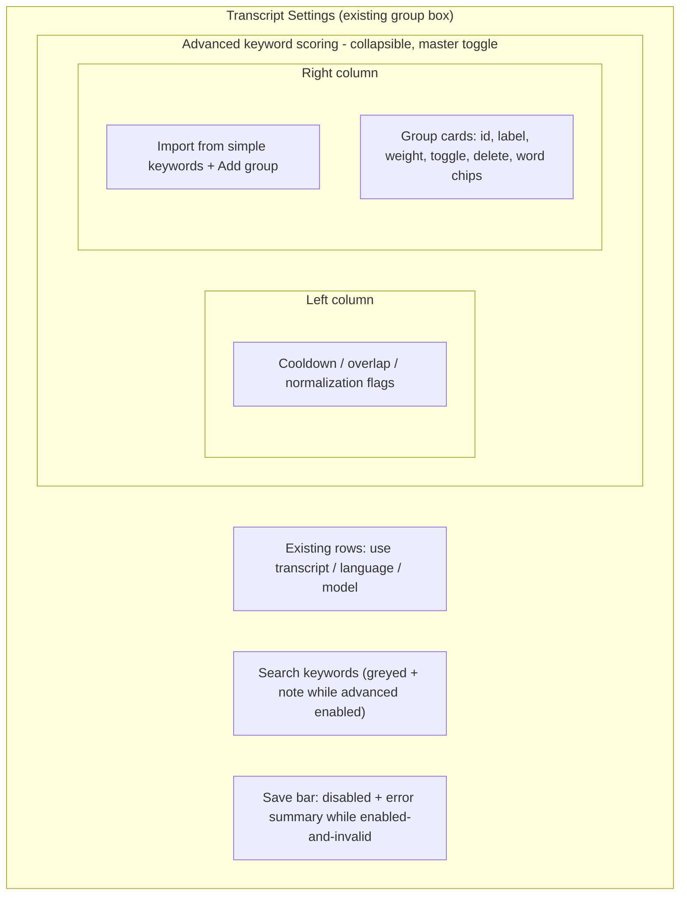
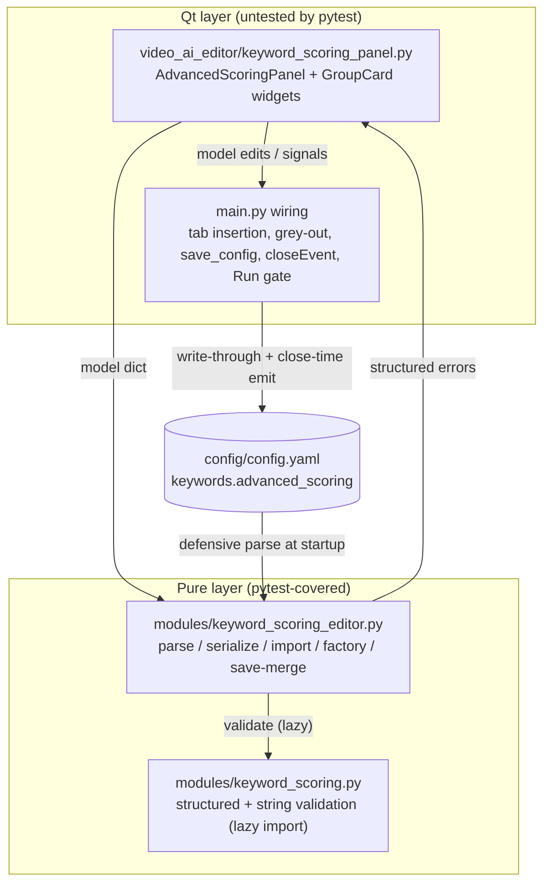
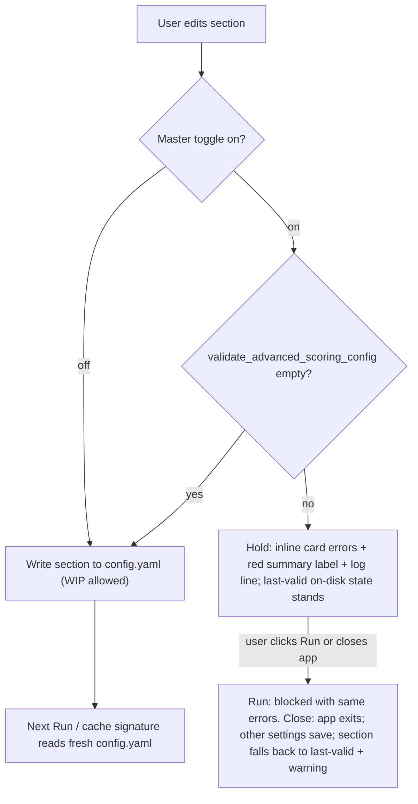

# Advanced Keyword Scoring GUI - Plan

## Goal Capsule

- **Objective:** A full in-app editor for `keywords.advanced_scoring` inside the Transcript & Subtitles tab, so weighted keyword groups never require hand-editing config.yaml.
- **Product authority:** The user's interface sketch (stacked group cards, two-column layout) plus the decisions recorded in Key Decisions below.
- **Open blockers:** None. The scoring engine this GUI edits already exists on branch `feat/advanced-keyword-scoring`.

---

## Product Contract

### Summary

Add an "Advanced keyword scoring" subsection to the Transcript Settings group of the Transcript & Subtitles tab: a master enable toggle, global matching knobs (cooldown, overlap prevention, normalization) in a left column, and editable keyword-group cards (id, label, weight, per-group toggle, chip-style words, drag-reorder) on the right — with inline validation, save gating, and a one-click import of the existing simple keyword list.

### Problem Frame

Advanced keyword scoring shipped config-only: every group, weight, and word edit means hand-editing nested YAML, with mistakes surfacing only as a run-time abort. Worse, the GUI's settings save currently rewrites config.yaml wholesale with no knowledge of `keywords.advanced_scoring` — any settings save from the app silently deletes a hand-written advanced config. The section is effectively hostile to the GUI until the GUI owns it.

### Key Decisions

- **Full editor, not partial controls.** Every `advanced_scoring` field is editable in the GUI — groups, words, weights, toggles, and the global knobs. config.yaml becomes storage, not an editing surface.
- **Save gating follows the engine's enabled/disabled semantics.** Invalid groups block the settings save only while the master toggle is on; with it off, work-in-progress groups save freely. This mirrors the engine, which never validates disabled config, and prevents WIP edits from locking the whole settings dialog.
- **Simple and advanced keyword UIs coexist; the inactive one greys out.** The simple Search-keywords field stays visible while advanced is enabled, disabled with a note that matching uses the groups — rather than swapping UIs, so both configs remain viewable.
- **`label` becomes an official optional group field.** A display-only human name per group (e.g. "Momento de pico") alongside the machine `id`; ignored by matching, validation, and the cache signature.
- **Drag-reorder is cosmetic.** Group order affects neither matching (entries are re-sorted by phrase length) nor the cache signature (sorted representation); the GUI preserves order in config.yaml purely for the user's organization.

### Requirements

**Editor surface**

- R1. The Transcript Settings group gains a collapsible "Advanced keyword scoring" subsection with a master enable toggle bound to `keywords.advanced_scoring.enabled`.
- R2. The subsection's left column edits the global matching knobs: cooldown seconds, prevent-overlapping-matches, and the four normalization flags.
- R3. Each group renders as a card with machine id, display label, weight, per-group enable toggle, delete action, and inline chip-style word editing (type-plus-Enter to add, per-chip remove, long lists collapsed behind a "+N more" expander).
- R4. Groups can be added, deleted, and drag-reordered, with order preserved in config.yaml.
- R5. `label` is an optional per-group display field, round-tripped on save and ignored by matching, validation, and the cache signature.
- R6. While advanced scoring is enabled, the simple Search-keywords field is visible but disabled, with a note that matching uses the groups; disabling advanced restores it.

**Validation and save behavior**

- R7. The editor validates continuously against the same rules as the engine's `validate_advanced_scoring_config` — duplicate normalized words within or across groups, blank or duplicate ids, non-numeric or negative weights, enabled groups with no words — showing each error inline at the offending field or card.
- R8. The settings save is blocked with an explanatory message only while advanced scoring is enabled and invalid; with the toggle off, invalid work-in-progress groups save freely.

**Persistence and config integrity**

- R9. The GUI reads and writes `keywords.advanced_scoring` in config.yaml via the nested accessor pattern; the section is never carried through the flat `gui_config` dict.
- R10. The settings save round-trips `keywords.advanced_scoring` intact — saving any settings preserves the subtree, fixing the current defect where the wholesale config rewrite silently deletes it.

**Migration**

- R11. An "Import from simple keywords" action creates a new group from the current simple search-keyword list, weighted at the current `keyword_points` value, leaving the simple list untouched.

### Section layout

### Acceptance Examples

- AE1. **Covers R7, R8.** Given advanced scoring enabled and the same word present in two groups, when the user tries to save settings, then the save is blocked and the duplicate is flagged on the offending card.
- AE2. **Covers R8.** Given those same invalid groups but the master toggle off, when the user saves, then the save succeeds and the work-in-progress state is written under `keywords.advanced_scoring`.
- AE3. **Covers R10.** Given an `advanced_scoring` section in config.yaml, when the user saves settings without touching the subsection, then the section survives with groups, order, labels, and all fields intact.
- AE4. **Covers R6.** Given advanced scoring enabled, when the user views Transcript Settings, then the Search-keywords field is greyed with the ignored-while-advanced note; toggling advanced off re-enables it.
- AE5. **Covers R11.** Given a simple keyword list and `keyword_points` of 8, when the user runs the import, then a new group appears containing those words at weight 8 and the simple list is unchanged.

### Scope Boundaries

- Live "test against a transcript" preview tool — deferred (also deferred in the engine plan).
- Per-group normalization overrides — normalization stays global.
- Auto-sync between the simple keyword list and the groups — rejected; import is a one-shot copy.
- Any change to simple-mode behavior or its existing GUI controls.

### Dependencies / Assumptions

- The engine, validation, and cache-signature work on branch `feat/advanced-keyword-scoring` is the substrate; the GUI reuses `validate_advanced_scoring_config` as the single source of validation truth rather than duplicating rules.
- Editing match-affecting settings (words, normalization, cooldown, overlap, enabled flags) invalidates the analysis cache by design; the next run re-analyzes. Confirmed: no in-UI warning about this.
- Weight-only edits do not invalidate the cache (weights are excluded from the signature by design).

### Sources / Research

- Transcript & Subtitles tab construction and the comma-separated keyword field: `main.py:1314-1372`.
- Settings save path that must learn to round-trip the section (current deletion defect): `main.py:2851-2952` — the save builds a fresh dict and overwrites config.yaml wholesale; only the `ui` section is currently merge-preserved (`main.py:2941-2943`).
- Engine accessor, validation, and matching: `modules/keyword_scoring.py` (`get_advanced_scoring_config`, `validate_advanced_scoring_config`, order-independent matching via length-sorted entries).
- Cache signature (weight excluded, group order sorted away): `modules/video_cache.py:26-63,138-141`.
- Reusable GUI precedents: `LabelSelectorDialog` (`main.py:67-151`), the composition-rules `QTableWidget` (`main.py:1578-1690`), and the avoid-list scroll-area card pattern (`main.py:1826-1988`).
- Engine plan marking GUI as follow-up work and requiring the nested accessor pattern: `docs/plans/2026-07-10-003-feat-advanced-keyword-scoring-plan.md`.

---

## Planning Contract

**Product Contract preservation:** unchanged. Planning discovered that main.py has no Save button — `save_config()` fires only from `closeEvent` and one checkbox-persist path, and the pipeline re-reads config.yaml from disk at run start. R8's "settings save" is therefore mapped onto the app's real persistence points (write-through on valid edits, close-time fallback, and a Run gate) in KTD2/KTD3 without altering the R-IDs' intent.

### Key Technical Decisions

- KTD1. **Three-layer split, mirroring the engine extraction pattern.** Pure editor-model logic (config dict ↔ editor model, defensive coercion, serialization, import transform, save-merge resolution) lives in a new stdlib-only `modules/keyword_scoring_editor.py` with full pytest coverage. Qt widgets live in a new `video_ai_editor/keyword_scoring_panel.py` (the repo's established home for extracted `QWidget` subclasses — `TranscriptPanel`, `SearchPanel`, `_SegmentRow`). main.py gets thin wiring only. GUI widget code stays outside pytest, consistent with the whole repo (PySide6 is not shimmed and not in requirements-dev.txt).
- KTD2. **Write-through persistence.** Because no Save button exists and `_run_highlighter_impl` re-reads config.yaml from disk, the panel persists `keywords.advanced_scoring` to config.yaml immediately whenever the section's state passes the save gate (valid, or master toggle off). This makes edits visible to the very next Run without an app restart. `save_config()` additionally re-emits the section from the panel model at close time so the wholesale-rebuild path can never drop it (R10); when the panel was never constructed or config parsing flagged a malformed section, `save_config()` falls back to preserving the subtree verbatim from `self.config_data` — the same pattern the `ui` section already uses (`main.py:2941-2943`).
- KTD3. **Gate scope: persist points and Run.** The enabled-and-invalid block (R8) applies at write-through, at `closeEvent`, and at Run. Close never blocks app exit: everything else saves, and the invalid `advanced_scoring` subtree falls back to its last-valid on-disk value with a `⚠️` line in the log. Run is gated identically — the pipeline already hard-aborts an enabled-invalid config at run time, so the GUI fails fast with the same validation messages instead of late.
- KTD4. **Structured validation added to the engine module, strings preserved.** `validate_advanced_scoring_config` currently returns flat strings; inline per-card display (R7) needs error-to-field mapping. Refactor `modules/keyword_scoring.py` to build structured errors (`{group_index, field, message}`) internally and derive the existing string list from them — one source of truth, existing string API and pipeline behavior unchanged. The GUI and editor model import from `modules.keyword_scoring` lazily (inside functions), because it transitively imports whisper via `modules.transcript`.
- KTD5. **Defensive load, never crash startup.** `VideoHighlighterGUI.__init__` is the only window; existing tabs populate widgets from `self.config_data` with no try/except. The editor model's parser coerces malformed shapes (groups not a list, non-dict group, non-numeric weight) into a flagged, resettable state instead of raising, so a hand-garbled section degrades to a visible "section could not be parsed — reset or fix config.yaml" card rather than preventing app launch.
- KTD6. **New groups are born disabled with an auto-id.** A freshly added group (blank id, no words) would otherwise be instantly invalid while the master toggle is on, locking the persist gate the moment the user clicks "Add group". The factory assigns a unique `group_N` id and `enabled: false`; the user enables the group once it has words.
- KTD7. **New UI primitives kept minimal.** No collapsible container, chip widget, or drag-reorder exists anywhere in this codebase. The subsection "collapse" is a master `QCheckBox` driving `.setEnabled()` cascades (the `on_transcript_toggle` pattern) plus a show/hide of the editor body; chips are flat `QPushButton` pills in a wrapping layout with a trailing add-`QLineEdit`; reorder uses per-card drag via a `QListWidget` in `InternalMove` mode hosting card widgets. Validation feedback uses the app's existing channels: inline red `QLabel`s (the `color: #c33` precedent) plus `append_log()` lines — no `QMessageBox` for validation.

### Assumptions

- Write-through on valid edits is an acceptable reading of R8's "settings save" given the app has no explicit Save action (headless-resolved; flagged for user review at PR time).
- Blocking Run on enabled-and-invalid config is surfacing the engine's existing hard-abort earlier, not new product behavior.
- Unknown per-group keys beyond the schema (`id`, `label`, `weight`, `enabled`, `words`) are preserved verbatim through parse/serialize so future engine fields survive GUI round-trips.

### High-Level Technical Design

Component boundaries and the persistence flow:

---

## Implementation Units

### U1. Structured validation in the engine module

**Goal:** `modules/keyword_scoring.py` produces field-addressable validation errors the GUI can pin to cards, while the existing string API stays byte-identical for the pipeline.

**Requirements:** R7

**Dependencies:** none

**Files:** `modules/keyword_scoring.py`, `tests/test_keyword_scoring.py`

**Approach:** Introduce `validate_advanced_scoring_config_structured(advanced_scoring) -> list[dict]` where each entry carries `group_index` (or `None` for config-level errors like non-list groups / bad cooldown), `field` (`id`, `weight`, `words`, `groups`, `cooldown_seconds`), and `message`. Reimplement `validate_advanced_scoring_config` as a thin wrapper returning `[e["message"] ...]` so every existing message string is produced verbatim from the structured source.

**Patterns to follow:** existing validation loop in `modules/keyword_scoring.py:63-143`; test style of `tests/test_keyword_scoring.py` (plain functions, local config-builder helpers).

**Test scenarios:**
- Happy path: a valid two-group config returns an empty structured list and an empty string list.
- Each rule yields a correctly-addressed entry: blank id at index 1 → `{group_index: 1, field: "id"}`; negative and non-numeric weight → `field: "weight"`; enabled group with no words → `field: "words"`; duplicate normalized word within a group and across two groups → entries carrying the offending group's index; non-list `groups` and non-numeric `cooldown_seconds` → `group_index: None`.
- Parity: for every invalid fixture above, the string list equals the structured entries' messages in order, and all pre-existing `test_keyword_scoring.py` assertions pass unchanged (characterization guard).
- A group with an extra `label` key produces no error (R5).

**Verification:** `pytest -q` green with the new and existing tests.

### U2. Pure editor model: `modules/keyword_scoring_editor.py`

**Goal:** All non-Qt editor logic — defensive parse, serialization, import transform, new-group factory, reorder, and save-merge resolution — as a stdlib-only module with full test coverage.

**Requirements:** R4, R5, R9, R10, R11

**Dependencies:** U1

**Files:** `modules/keyword_scoring_editor.py` (new), `tests/test_keyword_scoring_editor.py` (new)

**Approach:** Functions over a plain-dict model mirroring the config schema. `parse_section(config_data) -> (model, coercion_flags)` reads via the nested accessor and coerces malformed shapes without raising (KTD5): non-list `groups` → empty list + flag; non-dict group entries dropped + flag; non-numeric weight → `0` + flag; non-list words → coerced. `serialize_section(model) -> dict` reproduces the YAML shape preserving group order, `label`, and unknown per-group keys verbatim. `import_simple_keywords(words, keyword_points, existing_ids) -> group` builds the migration group with a unique id (R11, KTD6 naming). `new_group(existing_ids) -> group` returns `group_N`, `enabled: false`, empty words (KTD6). `resolve_section_for_save(panel_model_or_none, config_data) -> dict` implements KTD2/KTD3's fallback at the single choke point both `save_config` and `closeEvent` route through: serialize the model only when one exists, parsing was clean, AND the gate passes (toggle off, or validation empty — same lazy `validate_advanced_scoring_config` call as `should_persist`); in every other case (no model, coercion-flagged parse, or enabled-with-validation-errors) pass through the on-disk subtree verbatim so an invalid enabled state is never written. `reset_section() -> model`: the malformed-section card's reset action replaces the in-memory model with the default empty section (identical to missing-section parse behavior) and clears coercion flags; the reset itself does not write to disk — the fresh model becomes eligible for write-through only on the user's next gated edit. Import `modules.keyword_scoring` lazily inside any function that validates (KTD4 whisper note).

**Execution note:** This unit is the behavior core — implement test-first against the scenarios below.

**Test scenarios:**
- Happy path: `parse_section` on a well-formed section yields a model preserving group order, labels, weights, enabled flags, words; `serialize_section(parse_section(x)) == x` for that config, including an unknown `future_key` on a group.
- Missing/empty section → default model (`enabled: false`, no groups), no coercion flags.
- Coercion: `groups: "oops"` → empty groups + flag; a string in the groups list → dropped + flag; `weight: "abc"` → 0 + flag; `words: "a,b"` → coerced/flagged. None of these raise.
- Covers AE5: `import_simple_keywords(["estou morta", " vou morrer "], 8, [])` → group with weight 8, stripped words, both present, simple inputs untouched; id collision with an existing `imported` id yields a distinct unique id.
- Factory: two calls with `["group_1"]` existing produce `group_2` then (with both) `group_3`; new groups are `enabled: false` with empty words.
- Covers AE3: `resolve_section_for_save(None, config_data)` returns the on-disk subtree unchanged; with a clean valid model, returns the serialized model; with a coercion-flagged parse, returns the on-disk subtree (never a lossy coerced rewrite).
- Covers AE1/KTD3 close path: a cleanly-parsed model that is enabled and has validation errors (e.g. duplicate word across groups) → `resolve_section_for_save` returns the on-disk subtree, not the invalid serialization.
- Reset: `reset_section()` on a coercion-flagged model yields the default empty section with no flags; serializing it produces the missing-section default shape.
- Reorder: moving a group preserves all entries and changes only order; serialization reflects the new order (R4).

**Verification:** `pytest -q` green; module imports with no heavy deps at module level (no `whisper`/Qt in its import chain at import time).

### U3. `AdvancedScoringPanel` widget

**Goal:** The Qt subsection matching the approved sketch: master toggle, global knobs column, group cards with chip word editing, add/delete/drag-reorder, import button, inline validation display.

**Requirements:** R1, R2, R3, R4, R5, R7

**Dependencies:** U1, U2

**Files:** `video_ai_editor/keyword_scoring_panel.py` (new)

**Approach:** `AdvancedScoringPanel(QWidget)` owning the editor model (U2) and emitting a `section_changed` signal with the serialized dict + validity verdict on every edit. Master `QCheckBox` shows/hides the body and drives `.setEnabled()` cascades (KTD7). Global knobs: `QDoubleSpinBox` cooldown, overlap `QCheckBox`, four normalization `QCheckBox`es. Group cards follow the avoid-list scroll-area rebuild pattern (`main.py:1826-1988`): full rebuild on structural change, per-card closures bound to group id. Cards host id/label `QLineEdit`s, weight `QDoubleSpinBox`, enabled toggle, delete button, and a chip area — `QPushButton` pills with `✕`, a trailing add-`QLineEdit` (Enter commits), collapsed behind "+N more" past ~12 chips (expand before removing hidden chips). id/label/weight fields commit on `editingFinished`/focus-out (mirroring the chip Enter-to-commit pattern) before feeding `section_changed`, so write-through never fires per keystroke. Deleting a non-empty group is a two-step confirm — the delete button flips to a "confirm?" state on first click and fires on the second (consistent with the no-modal-dialog convention); freshly-added empty groups delete in one click. Structured errors (U1 via U2) render as red text on the offending card/field plus a section-level summary `QLabel` (`color: #c33` precedent). The coercion-flagged state renders a "section could not be parsed — reset or fix config.yaml" card whose Reset control invokes U2's `reset_section()`. Import button emits a signal main.py fulfills (it owns the simple-keywords field).

**Technical design (directional):** card list = `QListWidget` with `setDragDropMode(InternalMove)`, one `QListWidgetItem` per group with `setItemWidget(card)`. Qt pitfall this design must handle: the internal-move drop path serializes the item through mime data and recreates it, destroying the attached widget, and `rowsMoved` does not fire. So: store each group's id in the item's `Qt.UserRole` data (survives the drop), react to `rowsInserted`/`rowsRemoved` (or override `dropEvent`) to re-derive model order from item data, then run the panel's full card rebuild to restore widgets; set per-item `sizeHint` from each card and refresh it whenever the "+N more" expander toggles a card's height.

**Test scenarios:** Test expectation: none — Qt widget code is outside pytest in this repo (PySide6 unshimmed, no pytest-qt); behavior logic is covered in U2, and this unit is verified by the manual smoke in the Verification Contract.

**Verification:** Panel instantiates standalone (e.g. `python -c` smoke constructing it with a sample model under an offscreen QApplication) and the manual smoke flow passes.

### U4. Tab integration and load path in main.py

**Goal:** The panel appears inside the Transcript Settings area, loads defensively from `self.config_data` at startup, and the simple Search-keywords field greys out with a note while advanced is enabled.

**Requirements:** R1, R6, R9

**Dependencies:** U2, U3

**Files:** `main.py`

**Approach:** Instantiate `AdvancedScoringPanel` in the `transcript_tab` block (`main.py:1314-1372`) below the search-keywords row, seeded from `parse_section(self.config_data)` (KTD5 — coercion flags render the resettable state, never raise). Wire the panel's master-toggle signal to grey out `search_keywords_input` and show the "ignored while advanced scoring is enabled" note label, mirroring `on_transcript_toggle` (`main.py:2970`); apply the same state non-signal path at construction time (both-paths-in-sync convention). Import the panel module at top of main.py (Qt is already there); keep `modules.keyword_scoring` imports lazy.

**Test scenarios:** Test expectation: none — main.py wiring is outside pytest reach; covered by the manual smoke (startup with valid, missing, and hand-garbled sections; AE4 grey-out both ways).

**Verification:** App launches with a valid section, a missing section, and a deliberately malformed section (no crash, resettable state shown); AE4 behavior observed both ways.

### U5. Persistence, save gating, and Run gate

**Goal:** Write-through persistence of the section, close-time round-trip in `save_config()`, and the enabled-and-invalid gate at all three persist/act points — fixing the silent-deletion defect.

**Requirements:** R8, R9, R10

**Dependencies:** U2, U3, U4

**Files:** `main.py`, `modules/keyword_scoring_editor.py` (gate-decision helper), `tests/test_keyword_scoring_editor.py` (gate-decision helper tests)

**Approach:** On `section_changed`: if gate passes (toggle off, or validation empty), update `self.config_data["keywords"]["advanced_scoring"]` and write config.yaml (write-through, KTD2); if blocked, keep the in-memory model, show errors, log one `⚠️` line, leave disk untouched. In `save_config()` (`main.py:2851-2952`): emit the section via `resolve_section_for_save` (U2) into the rebuilt dict so the wholesale rewrite can never drop it (R10/AE3). In `closeEvent`: never block exit; on enabled-and-invalid, persist everything else, keep the last-valid on-disk subtree, log the fallback (KTD3). The Run gate lives in `run_pipeline()` (`main.py:3518`), not `toggle_run` — that single check covers both the Run button and the download auto-process entry point (`auto_start_pipeline`, `main.py:2511-2520`, which calls `run_pipeline()` directly); if enabled-and-invalid, refuse with the same messages in the log (KTD3). Write-through is implemented as: update `self.config_data["keywords"]["advanced_scoring"]`, then call `save_config()` (whose rebuilt dict embeds the section via `resolve_section_for_save`), matching the existing config_data-mutate-then-save precedent at `main.py:4105-4107` and inheriting its error handling. The pure gate decision (`should_persist(model) -> (bool, errors)`) lives in U2's module and is tested there.

**Test scenarios (pure gate helper, in `tests/test_keyword_scoring_editor.py`):**
- Covers AE2: toggle off + invalid groups → persist allowed, serialized WIP state returned.
- Covers AE1: toggle on + duplicate word across groups → persist blocked with the duplicate's structured error.
- Toggle on + valid → persist allowed.
- Error paths: coercion-flagged model → persist blocked with a "section could not be parsed" reason (never write a lossy coerced rewrite).

**Verification:** Manual smoke: edit a group and confirm config.yaml updates immediately; make it invalid (enabled) and confirm disk state stays last-valid, Run refuses with logged errors, and closing the app exits cleanly while preserving other edited settings; relaunch shows the last-valid section (AE1-AE3 end to end).

### U6. Import from simple keywords

**Goal:** The one-click migration action (R11) wired end to end.

**Requirements:** R11

**Dependencies:** U2, U3, U4

**Files:** `main.py`, `video_ai_editor/keyword_scoring_panel.py`

**Approach:** The panel's import signal is handled in main.py: read `get_text_list(self.search_keywords_input)` and the current `keyword_points` (flat gui pattern is correct here — both are GUI-mirrored settings), call `import_simple_keywords` (U2), append the group to the model, refresh cards. Disable the button with a tooltip when the simple list is empty.

**Test scenarios:** The transform is covered in U2 (AE5). GUI glue: Test expectation: none — covered by manual smoke (import with your real 18-keyword list; confirm weight 8 group appears and the simple field is untouched).

**Verification:** Manual smoke import matches AE5.

---

## Verification Contract

| Gate | Command / action | Applies to | Done signal |
|---|---|---|---|
| Unit tests | `pytest -q` | U1, U2, U5 (pure logic) | Green, including unchanged pre-existing `test_keyword_scoring.py` assertions |
| Import hygiene | `python -c "import modules.keyword_scoring_editor"` (no shims) | U2 | Imports clean with stdlib only |
| Panel smoke | Offscreen-QApplication construction of `AdvancedScoringPanel` with a sample model | U3 | No exception; cards render |
| Manual smoke | Launch GUI; run AE1-AE5 end to end (edit, invalidate, run-gate, close, relaunch, import) | U3-U6 | Behavior matches each AE; config.yaml round-trips with a hand-written section |
| Regression | Save settings without touching the new section | U5 | Pre-existing `advanced_scoring` subtree survives semantically intact — `yaml.safe_load` of the subtree before and after the save compares equal, including group order, labels, and unknown keys (AE3; yaml re-dump legitimately normalizes comments/quoting, so byte equality is not the bar) |

## Definition of Done

- All units U1-U6 implemented; R1-R11 each traceable to landed code.
- AE1-AE5 verified via the manual smoke.
- `pytest -q` green in CI.
- The silent-deletion defect is closed: a GUI settings save can no longer drop `keywords.advanced_scoring`.
- No behavior change to simple-mode scoring or any other settings section's save path.
