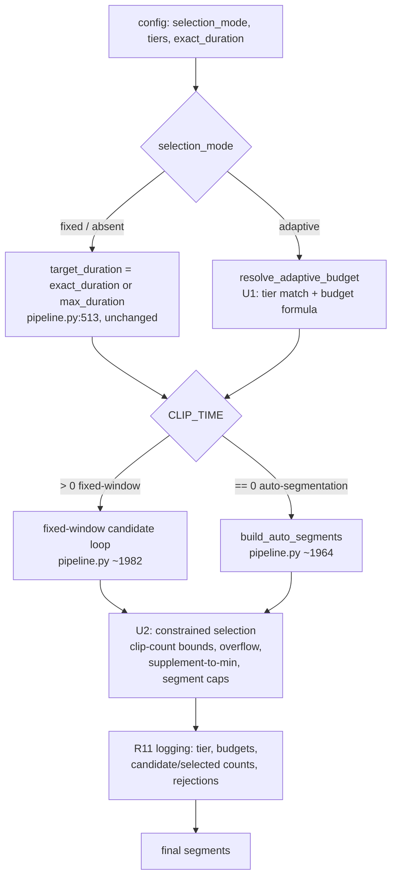

# Adaptive Top-X Highlight Selection - Plan

## Goal Capsule

- **Objective:** Auto-size the highlight selection budget from source video duration via user-configurable percentage tiers, so a single config works across 30-minute clips and 6+ hour streams without manual re-tuning.
- **Product authority:** This document, sourced from [GitHub issue #16](https://github.com/pixelfreaki/VideoHighlighter/issues/16) and brainstorm dialogue.
- **Open blockers:** None.
- **Execution profile:** Code changes with unit tests for all pure logic (tier/budget resolution, constrained selection); pipeline wiring includes a characterization test proving fixed-mode behavior is unchanged; GUI wiring gets manual smoke verification (no Qt test harness in this repo).
- **Product Contract preservation:** Unchanged. This enrichment adds Planning Contract, Implementation Units, Verification Contract, and Definition of Done only.

---

## Product Contract

### Summary

Add an opt-in `selection_mode: adaptive` that computes the highlight budget from source video duration using configurable percentage tiers, clamped by per-tier duration and clip-count bounds. The existing fixed-duration mode (`max_duration`/`exact_duration`) remains the default and is unaffected.

### Problem Frame

Highlight selection is driven by a single `max_duration` or `exact_duration` value applied uniformly regardless of source length (`pipeline.py:513`: `target_duration = EXACT_DURATION if EXACT_DURATION else MAX_DURATION`). A value tuned for a 1-hour recording under-selects from a 6-hour stream and over-selects from a short clip, forcing per-video manual tuning. Issue #16 asks the system to size itself instead.

### Key Decisions

- **`exact_duration` overrides adaptive.** When the user sets a nonzero `exact_duration`, it wins outright and the tier/budget calculation is skipped — explicit intent beats a computed guess. This mirrors the precedence `exact_duration` already has over `max_duration` today (`pipeline.py:513`).
- **Adaptive is opt-in; fixed stays the default.** A new `selection_mode` key controls this. Configs with no `selection_mode` (or `selection_mode: fixed`) behave exactly as they do today.
- **Adaptive changes only the selection/budget step, not scoring.** The existing per-second scoring signals (scene, motion, audio, keyword, transcript, object, action points) are untouched; adaptive changes how large a budget the selection loop may spend and how many clips it may pick.
- **Clip-count bounds are new mechanism, not reuse.** Today's selection loop (`pipeline.py:1982-2033`) bounds only total duration; a minimum/maximum clip count does not exist yet.

### Requirements

**Budget calculation**

- R1. When `selection_mode: adaptive` and a nonzero `exact_duration` is set, `exact_duration` is used as the budget and tier lookup is skipped.
- R2. Otherwise, the budget is `min(tier_maximum_duration, max(tier_minimum_duration, source_duration × tier_percentage))`, using the matched tier's own percentage and duration bounds.
- R3. Tiers are evaluated ascending by their duration-maximum threshold; the first tier whose threshold the source duration meets wins. A fallback tier with no maximum threshold always matches longer sources.
- R4. Each tier carries its own minimum and maximum duration bounds; the shipped defaults span 120s-1800s across tiers from 10% (≤1 hour) down to a 2.5% fallback, matching the issue's proposal.

**Clip count**

- R5. The final selection contains between a configurable minimum and maximum clip count (defaults 3 and 20), independent of the duration budget.
- R6. If the sorted candidate list would otherwise produce fewer than the minimum clip count, lower-scored candidates are supplemented in until the minimum is met, even if this exceeds the computed budget.

**Overflow tolerance**

- R7. The selection loop may exceed the computed budget by up to 10%, and by at most one candidate clip past the limit — not unlimited small overflows.

**Segment-based distribution (optional)**

- R8. When enabled, the source is divided into 30-minute segments; each selected clip is attributed to its segment, and each segment carries a soft cap on clips contributed.
- R9. A segment's cap is relaxable: if the minimum clip count (R6) isn't met and no other segment has viable candidates, the cap is exceeded rather than under-delivering.
- R10. Segment-based distribution is off by default; adaptive mode functions correctly without it.

**Logging**

- R11. Selection logging reports, per run: source duration, matched tier, calculated budget, final budget (after overflow/minimum-clip adjustments), candidates considered, candidates selected, and the rejection reason for each skipped top candidate (budget exhausted, segment cap, overlap).

**Configuration and GUI**

- R12. Adaptive mode, its tiers, and its clip-count bounds are configurable via both YAML (`highlights:` block) and the GUI, with the same round-trip discipline as existing highlight settings.
- R13. The GUI includes a mode selector (fixed vs. adaptive), a tier editor with inline validation (tier ordering, sane percentage/bound values), and a live preview table showing the computed budget for six standard source durations, recomputed as tiers are edited.

**Compatibility**

- R14. Configs with no `selection_mode` key behave identically to current fixed-mode behavior; no adaptive code path is exercised.

### Acceptance Examples

- AE1. **Covers R1.** **Given** `selection_mode: adaptive` and `exact_duration: 300`, **when** selection runs, **then** the budget is exactly 300s and no tier lookup occurs.
- AE2. **Covers R2, R3.** **Given** tiers `[{max_source_duration: 3600, percentage: 0.10, min_duration: 120, max_duration: 600}, {max_source_duration: none, percentage: 0.025, min_duration: 300, max_duration: 1800}]` and a 45-minute source, **when** selection runs, **then** the first tier matches (45 min ≤ 60 min) and the budget is `min(600, max(120, 2700×0.10))` = 270s.
- AE3. **Covers R2, R3.** **Given** the same tiers and an 8-hour source, **when** selection runs, **then** no finite-threshold tier matches, the fallback applies, and the budget is `min(1800, max(300, 28800×0.025))` = 720s.
- AE4. **Covers R5, R6.** **Given** a 300s budget and only 2 qualifying candidates, **when** selection runs, **then** the system supplements with the next-highest-scored candidates until at least 3 clips are selected, exceeding 300s.
- AE5. **Covers R7.** **Given** a 300s budget, **when** the sorted candidate list is consumed, **then** at most one clip may push total duration up to 330s (10% overflow); no second overflow clip is added.
- AE6. **Covers R8, R9.** **Given** segment distribution enabled with a 2-clip soft cap, **when** a segment is already at its cap but the minimum clip count isn't met and no other segment has viable candidates, **then** a 3rd clip from that segment is selected despite the cap.
- AE7. **Covers R14.** **Given** an existing config with no `selection_mode` key, **when** selection runs, **then** behavior is identical to today's fixed-mode logic.

### Scope Boundaries

- **Deferred for later:** removing or deprecating fixed mode; visual polish of the tier editor beyond functional validation and the preview table.
- **Out of scope:** changes to the per-second scoring algorithm (scene/motion/audio/keyword/object/action points) — adaptive only changes selection and budgeting; migrating existing saved configs (none needed, since fixed remains the default).

### Dependencies / Assumptions

- Source video duration is available before selection runs (already used at `pipeline.py:513`).
- The issue's example tier percentages/thresholds (10% ≤1h down to 2.5% fallback) are shipped defaults, not hardcoded limits — tiers must remain user-editable.
- Segment-based distribution's 30-minute buckets (R8) are relative to the same analyzed-range duration used for tier lookup (see Planning Contract Assumptions) — not absolute file time — so both forks resolve identically when time-range trimming is active.

### Outstanding Questions

None remaining — the two deferred-to-planning validation-rule questions are resolved in the Planning Contract (Key Technical Decisions) below.

### Sources / Research

- [GitHub issue #16](https://github.com/pixelfreaki/VideoHighlighter/issues/16) — "Adaptive Top-X Selection", opened by pixelfreaki.
- `pipeline.py:513-514` — `target_duration`/`duration_mode` computed from `EXACT_DURATION`/`MAX_DURATION`; confirms `exact_duration` already takes precedence today (grounds R1's precedence rule).
- `pipeline.py:478-479` — `MAX_DURATION`/`EXACT_DURATION` read from `gui_config`/`config` with current defaults (420s, `None`).
- `pipeline.py:1960-1980` — the `CLIP_TIME=0` auto-segmentation path (`build_auto_segments`) also consumes `target_duration`; an adaptive budget must feed both this path and the fixed-window path.
- `pipeline.py:1982-2033` — fixed-window selection loop: sorts candidates by score/confidence, greedily fills up to `target_duration`, breaks at the threshold. This is the mechanism the issue's algorithm extends; no clip-count bound exists here today (R5/R6 are new).
- `main.py:1213-1218` — existing Max/Exact duration GUI controls in the Highlights config section; a natural location for the new mode selector and tier editor.
- `main.py:2420-2421`, `main.py:2958-2959`, `main.py:3827-3828` — three separate `gui_config`-building call sites read `max_duration`/`exact_duration`; this repo has a known pattern of duplicated config-builders that must be kept in sync when new fields are added.
- `config/config.yaml` — existing `highlights:` block (`auto_min_clip`, `auto_max_clip` are per-clip duration bounds, orthogonal to adaptive's clip-*count* bounds; no conflict).

---

## Planning Contract

### Key Technical Decisions

- **KTD1. Extend the existing selection pattern via an explicit legacy-mode branch, not an unspecified "pass-through."** `modules/auto_segments.py:select_regions()` (`modules/auto_segments.py:321-355`) and the fixed-window loop (`pipeline.py:1997-2033`) already do greedy candidate selection filling a target duration — but they rank candidates differently (density `score/duration` vs. `lexsort((-confidence, -score))`) and both truncate their *final* accepted candidate to end exactly at the budget. A shared function must therefore carry an explicit `preserve_legacy_mode` branch: when true (`selection_mode` fixed/absent), it uses the caller's original ranking order, truncates the last accepted candidate to fill `remaining` exactly (matching each existing loop's current behavior), and disables clip-count bounds and overflow (unbounded count, zero tolerance) — reproducing today's output byte-for-byte rather than merely "within bounds." When false (adaptive), the shared function ranks by density, applies clip-count bounds, and allows the one-clip overflow (R5-R7). This resolves the reviewed gap where an unspecified pass-through would have silently changed fixed-mode output and violated R14.
- **KTD2. Distinct naming for clip-count bounds vs. existing per-clip duration bounds.** `build_auto_segments()` already has `min_clip`/`max_clip` parameters meaning per-clip *duration* (seconds) — see `modules/auto_segments.py:372-373`. The new feature's clip-*count* bounds (R5) use distinctly named identifiers (`clip_count_min`/`clip_count_max`) throughout code, config, and logs to avoid confusing the two concepts.
- **KTD3. Global duration bounds are shipped-tier defaults, not hardcoded clamps.** The issue's 120s-1800s range is the shipped default tiers' own min/max values, not a system-wide clamp in code. Tier editor and config-load validation enforce: per-tier `min_duration ≤ max_duration`, thresholds strictly ascending, the fallback (no-maximum) tier sorts last, and `clip_count_min ≤ clip_count_max`.
- **KTD4. Scarce-candidate fallback.** If fewer than `clip_count_min` viable candidates exist anywhere in the source (very short or low-signal video), selection returns what's available with a logged warning rather than erroring or looping — R6's supplement-to-minimum is best-effort, not a hard guarantee.
- **KTD5. Preview table ships with six fixed durations.** 30 min, 1h, 2h, 4h, 8h, 24h — spanning the default tier set's thresholds so every shipped tier is exercised at least once in the live preview.
- **KTD6. Tier/budget settings excluded from the analysis-cache signature.** They only change which already-scored seconds get selected, never the analysis itself, mirroring the existing weight-exclusion precedent in `_advanced_scoring_signature` (`modules/video_cache.py:26-35`, which excludes `keywords.advanced_scoring`'s per-group `weight` for the identical reason).
- **KTD7. `resolve_adaptive_budget()` returns a `(budget, duration_mode)` pair, not a bare number.** The existing pipeline needs `duration_mode` ("EXACT" vs. "MAX") to pick the candidate pool (all seconds vs. `score > 0` only, `pipeline.py:1985-1988`) and the loop's cutoff comparison (`pipeline.py:2030-2032`). `exact_duration` override (R1) resolves to `"EXACT"`; a tier-computed budget resolves to `"MAX"` (it is a ceiling to fill up to, not an exact target). U3 compares against this resolved pair everywhere, never against the raw `EXACT_DURATION`/`MAX_DURATION` globals, closing a `TypeError`/wrong-cutoff landmine the unspecified original design would have hit on every adaptive run.

### Assumptions

- **Tier lookup's `source_duration` uses the analyzed range, not raw file duration.** When `use_time_range` trims the analyzed window (`range_start_pct`/`range_end_pct`), the budget's `source_duration` input is the analyzed range's length — that's the actual pool of selectable content. This was surfaced as an open fork during planning but not confirmed interactively (this run proceeded in pipeline/headless mode). Revisit if the user's intent was raw file length instead.

### High-Level Technical Design



Both selection paths funnel through the same constrained-selection layer (U2) regardless of `selection_mode`. Per KTD1, that layer carries an explicit `preserve_legacy_mode` branch — original ranking order, final-candidate truncation to `remaining`, no clip-count/overflow constraints — so fixed-mode output stays byte-identical to today (R14); clip-count bounds and overflow tolerance apply only in the adaptive branch.

---

## Implementation Units

### U1. Tier resolution and budget calculation module

- **Goal:** Pure function(s) resolving the matching tier and computing the adaptive budget from source duration.
- **Requirements:** R1, R2, R3, R4.
- **Dependencies:** None.
- **Files:** `modules/highlight_budget.py` (new), `tests/test_highlight_budget.py` (new).
- **Approach:** `resolve_tier(tiers, source_duration)` returns the first tier (ascending by `max_source_duration`) whose threshold the duration meets; the null-max tier always matches as fallback (R3). `compute_budget(tier, source_duration)` applies `min(tier.max_duration, max(tier.min_duration, source_duration × tier.percentage))` (R2, R4). `resolve_adaptive_budget(config, source_duration)` is the entry point and returns a `(budget, duration_mode)` pair per KTD7: `(exact_duration, "EXACT")` when set and nonzero (R1), else `(compute_budget(resolve_tier(...)), "MAX")`. Stdlib-only, no yaml/torch/cv2 imports — yaml parsing stays at the config-loading edge in `pipeline.py`/`main.py`, matching the `modules/` dependency-light convention (e.g. `modules/dataset_import.py`, `modules/cli_args.py`).
- **Test scenarios:**
  - Covers AE1: `exact_duration` set and nonzero → returns `(exact_duration, "EXACT")`, no tier lookup.
  - Covers AE2, AE3: the Product Contract's worked examples (45-min source → `(270, "MAX")`; 8-hour source → fallback tier → `(720, "MAX")`).
  - Tier list with only a fallback tier (no finite-threshold tiers) → fallback always matches.
  - Source duration exactly at a tier's threshold boundary → confirm inclusive matching.
  - Computed budget clamped by tier min/max on both ends (percentage result below min, above max, in range).
  - Empty or malformed tiers list → documented, non-crashing behavior (pick and test one: e.g. falls back to the existing fixed-mode formula, returning `(max_duration, "MAX")`).
- **Verification:** `pytest -q tests/test_highlight_budget.py` green; AE2/AE3 numbers match exactly.

### U2. Constrained selection: clip-count bounds, overflow tolerance, segment distribution

- **Goal:** Given ranked candidates and a computed budget, select a final clip list obeying clip-count bounds, one-overflow-clip tolerance, supplement-to-minimum, and optional segment caps.
- **Requirements:** R5, R6, R7, R8, R9, R10.
- **Dependencies:** U1 (consumes its budget output; independently testable with a hardcoded budget).
- **Files:** `modules/auto_segments.py` (new function alongside `select_regions`), `tests/test_auto_segments.py` (extend if it exists, else create).
- **Approach:** A new function (e.g. `select_regions_bounded`) wraps the existing greedy loop shape from `select_regions` (`modules/auto_segments.py:321-355`), carrying the `preserve_legacy_mode` branch from KTD1: when `preserve_legacy_mode=True` (fixed/absent `selection_mode`), candidates are consumed in the caller-supplied order (not re-ranked by density), the final accepted candidate is truncated to end exactly at `remaining` (matching both existing loops' current truncation), and `clip_count_min=0`/`clip_count_max=inf`/`overflow_pct=0` so no new constraint activates — reproducing today's output exactly. When `preserve_legacy_mode=False` (adaptive), candidates are ranked by density as `select_regions` already does, and: (a) if selected count < `clip_count_min`, keep consuming ranked candidates past budget until the minimum is reached or candidates are exhausted (R6, KTD4); (b) allow at most one candidate to push total duration up to `budget × 1.10`, never more (R7); (c) stop early at `clip_count_max` even if budget remains (R5); (d) when segment distribution is enabled, partition the analyzed range into 30-min buckets (per the Assumptions section), track a per-segment count, skip a candidate whose segment is at cap unless the minimum isn't met and no other segment has viable candidates (R8, R9). Parameter names follow KTD2 (`clip_count_min`/`clip_count_max`, not `min_clip`/`max_clip`).
- **Technical design** (directional, not implementation-specification):
  ```
  select_regions_bounded(ranked_candidates, budget, clip_count_min, clip_count_max,
                          overflow_pct=0.10, segments=None, segment_cap=None,
                          preserve_legacy_mode=False):
    candidates = ranked_candidates if preserve_legacy_mode else rank_by_density(ranked_candidates)
    selected = []; total = 0; overflow_used = False
    for c in candidates (no time-overlap with already selected):
      if not preserve_legacy_mode and len(selected) >= clip_count_max: break
      if not preserve_legacy_mode and segment_at_cap(c) and not last_resort(clip_count_min, selected, remaining):
        continue
      remaining = budget - total
      if remaining <= 0:
        if not preserve_legacy_mode and not overflow_used and total <= budget * (1 + overflow_pct):
          overflow_used = True
        else:
          break
      if c.duration > remaining:
        c = truncate(c, remaining)   # exact-fill truncation, both modes
      selected.append(c); total += c.duration
    # adaptive only: if len(selected) < clip_count_min, supplement past budget from remaining candidates
    return selected
  ```
- **Test scenarios:**
  - Covers AE4: budget 300s, only 2 qualifying candidates → supplements to reach `clip_count_min` (3), exceeding budget.
  - Covers AE5: budget 300s → at most one overflow clip pushes total to ≤330s; no second overflow.
  - Covers AE6: segment cap 2, minimum not met, no other segment has candidates → 3rd clip from the capped segment selected anyway.
  - `clip_count_max` reached before budget exhausted → selection stops even with budget remaining.
  - Zero candidates → returns empty list with a logged warning, does not error (KTD4).
  - Fewer than `clip_count_min` candidates exist in the entire pool → returns all available, logs a warning, does not loop forever (KTD4).
  - Segment distribution disabled (default) → behaves identically to the non-segmented path (R10).
  - Overlapping candidates → existing overlap-rejection behavior (mirrors `select_regions`'s `_shares_time` check) is preserved.
  - **`preserve_legacy_mode=True`, given the exact candidate set and budget from an existing `select_regions` call → output is byte-identical to `select_regions`'s current output** (proves KTD1's fixed-mode guarantee at the unit level, ahead of U3's full-pipeline characterization test).
- **Verification:** unit tests green; a check that both the fixed-window path (U3) and auto-segmentation path produce clip counts within `[clip_count_min, clip_count_max]` in adaptive mode, and byte-identical output to today in legacy mode.

### U3. Pipeline wiring: adaptive budget resolution and dual-path integration

- **Goal:** Wire config-driven adaptive mode into `pipeline.py` so both selection paths use the computed budget and constrained-selection layer, with full logging.
- **Requirements:** R1-R11 (integration), R14.
- **Dependencies:** U1, U2.
- **Files:** `pipeline.py` (the `target_duration`/`duration_mode` resolution around line 513; the auto-segmentation call around line 1964; the fixed-window loop around lines 1982-2033).
- **Approach:** Replace the direct `target_duration = EXACT_DURATION if EXACT_DURATION else MAX_DURATION` / `duration_mode = "EXACT" if EXACT_DURATION else "MAX"` pair with a call into U1's `resolve_adaptive_budget(config, source_duration)` when `selection_mode == "adaptive"`, using its returned `(budget, duration_mode)` pair everywhere downstream instead of the raw `EXACT_DURATION`/`MAX_DURATION` globals (KTD7) — including the fixed-window loop's cutoff comparisons at `pipeline.py:2030-2032`. When `selection_mode` is fixed/absent, the existing two-line resolution is unchanged (R14). `source_duration` passed into `resolve_adaptive_budget()` is the analyzed range's length (post `use_time_range` trimming when active), not raw file duration, per the Assumptions section. Both `build_auto_segments()`'s internal selection and the fixed-window loop's candidate selection route through U2's `select_regions_bounded()`, passing `preserve_legacy_mode=(selection_mode != "adaptive")` — for the fixed-window path this replaces the hand-rolled greedy loop with a call into the shared function. Add the R11 log lines: source duration, matched tier, calculated budget, final budget after adjustments, candidates considered/selected, and per-candidate rejection reasons.
- **Execution note:** Start with a characterization test around the existing fixed-window loop's current behavior (target-duration cutoff, `used_seconds` dedup, exact segment boundaries — not just aggregate duration/count) before refactoring it to call the shared bounded-selection function in `preserve_legacy_mode`, so the refactor is provably behavior-preserving for fixed mode at the segment-boundary level, not merely "within bounds."
- **Test scenarios:**
  - Covers AE7: config with no `selection_mode` key → `target_duration`/`duration_mode` computed exactly as today; fixed-window output is byte-identical (segment start/end times, not just count/duration) to the pre-refactor characterization baseline.
  - Adaptive mode + `exact_duration` set → `resolve_adaptive_budget()` returns `(exact_duration, "EXACT")`, and the pipeline's candidate pool/cutoff behave as today's EXACT mode does.
  - Adaptive mode, no `exact_duration` → `resolve_adaptive_budget()` returns `(tier_budget, "MAX")`; the fixed-window loop's `current_duration >= target_duration` cutoff (not the stale `MAX_DURATION` global) governs the break, and the candidate pool follows MAX-mode filtering (`score > 0` only).
  - Adaptive mode, fixed-window path (`CLIP_TIME > 0`) → final segment count within configured clip-count bounds.
  - Adaptive mode, auto-segmentation path (`CLIP_TIME == 0`) → same bound guarantee via `build_auto_segments`'s use of the bounded selector.
  - Log output contains all R11 fields for at least one adaptive run.
- **Verification:** existing selection-adjacent tests stay green; new integration tests pass; manual smoke on a short test video in both `CLIP_TIME=0` and `CLIP_TIME>0`, adaptive and fixed modes, confirming log lines appear and clip counts respect bounds.

### U4. Config schema and defaults

- **Goal:** Define adaptive mode's config key names, shapes, and defaults — the schema every other unit agrees on.
- **Requirements:** R12, R14.
- **Dependencies:** U1 (agrees on the tiers list shape/field names).
- **Files:** `config/config.yaml` and root `config.yaml` (documented defaults and comments).
- **Approach:** Define `selection_mode` (`"fixed"`|`"adaptive"`, default `"fixed"`), `tiers` (list of `{max_source_duration, percentage, min_duration, max_duration}`), `clip_count_min`/`clip_count_max` (defaults 3/20), `overflow_pct` (default 0.10), `segment_distribution_enabled` (default `false`), `segment_minutes` (default 30), `segment_cap`. This unit fixes names and defaults only — no `main.py` widget code. (Split from an earlier single "config + GUI plumbing" unit: the original approach required reading GUI widget state that doesn't exist until U5 builds it, a backward dependency caught in review. U7 now owns the actual `main.py` plumbing.)
- **Test scenarios:** Test expectation: none — schema/defaults only, no independent logic; correctness is covered by U3's integration tests and U6/U7's consumption of these names.
- **Verification:** manual check that `resolve_adaptive_budget()` (U1) and `build_analysis_cache_params()` (U6) agree on every field name defined here.

### U5. GUI: mode selector, tier editor, live preview table

- **Goal:** Expose adaptive mode configuration in the existing Duration & Cutting group.
- **Requirements:** R13.
- **Dependencies:** U4 (field names).
- **Files:** `main.py` (Duration & Cutting `QGroupBox`, around lines 1206-1224).
- **Approach:** Add a mode selector (`QComboBox`: Fixed / Adaptive) beside the existing max/exact duration spinners; disable (grey out) `spin_max_duration` while Adaptive is selected, since it's inert under adaptive tiers, and show an inline note beneath the tier editor when `exact_duration` is nonzero in Adaptive mode ("Exact duration is set — tiers are unused"), mirroring the existing `auto_seg_info_label` convention. In Adaptive mode, reveal a tier editor (`QTableWidget`-based) with rows for `max_source_duration`/`percentage`/`min_duration`/`max_duration`, inline validation per KTD3 (ascending thresholds, min ≤ max per tier, fallback row last, `clip_count_min ≤ clip_count_max`), plus `clip_count_min`/`clip_count_max` spinners. The fallback (no-maximum) row's delete control is disabled — the table can never reach zero tiers. Save is gated on tier validity: while any row is invalid, Save stays disabled (or persists the last-known-valid on-disk tier list unchanged), mirroring the save-gating precedent already established by this codebase's keyword-scoring editor (`modules/keyword_scoring_editor.py`'s `resolve_section_for_save`) for the same shape of problem — an inline-validated table feeding a config block. Add a live preview table showing the six fixed durations from KTD5, recomputed via U1's `resolve_adaptive_budget()` on every tier-editor edit; while the current tier set is invalid, the preview freezes at its last valid computation rather than clearing or erroring.
- **Test scenarios:** Test expectation: none — Qt GUI code with no test harness in this repo.
- **Verification:** manual smoke — switch to Adaptive, edit tiers, confirm the preview table updates live and rejects an invalid tier (e.g. descending thresholds) with a visible error and disabled Save; confirm the fallback row cannot be deleted; save and reload config, confirm the tier list round-trips; confirm `spin_max_duration` is disabled in Adaptive mode.

### U6. Cache signature exclusion

- **Goal:** Prove adaptive's tier/budget/clip-count settings never enter the analysis-cache signature (KTD6).
- **Requirements:** Supports R12-R14's correctness under caching (load-bearing per KTD6, not independently product-numbered).
- **Dependencies:** U4 (field names must exist to test their exclusion).
- **Files:** `modules/video_cache.py` (a short comment mirroring the existing `_advanced_scoring_signature` exclusion comment, if any change is needed at all — new keys are simply never read into the params dict), `tests/test_video_cache.py`.
- **Test scenarios:**
  - Two `gui_config`s identical except for `selection_mode`/`tiers`/`clip_count_min`/`max` → `build_analysis_cache_params()` returns identical dicts (proves exclusion).
  - Existing signature tests remain unaffected — no regression in what IS included.
- **Verification:** `pytest -q tests/test_video_cache.py` green.

### U7. Wire config into the three gui_config-building call sites

- **Goal:** Thread U4's config keys through `main.py`'s widget state into the flat `gui_config` dict the pipeline reads.
- **Requirements:** R12, R14.
- **Dependencies:** U4 (field names), U5 (the widgets being read must exist).
- **Files:** `main.py` (the three `gui_config`-building call sites around lines 2420, 2958, 3827; `save_config`'s persisted block).
- **Approach:** All three call sites read the same U5 widget state (`self.combo_selection_mode`, the tier table, the clip-count spinners) and populate `gui_config` with U4's key names; keep them in sync per the repo's known triplication pattern (this repo has no single source of truth for `gui_config` construction — flagged in Sources).
- **Test scenarios:** Test expectation: none — pure plumbing; correctness is covered by U3's integration tests reading the resulting `gui_config` and U5's manual GUI smoke (config round-trip).
- **Verification:** manual check that a config with the new keys round-trips through all three `gui_config` call sites without `KeyError`s, and that default values (U4) apply cleanly when keys are absent (R14).

---

## Verification Contract

| Gate | Command / procedure | Proves |
|---|---|---|
| Unit tests | `pytest -q` | U1, U2, U6 logic (including U2's `preserve_legacy_mode` byte-identical test); U3's characterization/integration tests; import-completeness gate for `modules/highlight_budget.py` |
| Fixed-mode characterization | Part of `pytest -q` (U3's characterization test) | R14 — fixed-mode output is byte-identical (segment boundaries, not just aggregate duration/count) before/after the refactor |
| Manual smoke: fixed-window adaptive | Run a short clip with `CLIP_TIME > 0`, `selection_mode: adaptive` | U3, AE2/AE3 in real pipeline context |
| Manual smoke: auto-segmentation adaptive | Run with `CLIP_TIME == 0`, `selection_mode: adaptive` | U3's auto-segmentation path, AE6 (segment distribution) |
| Manual smoke: GUI | U5's procedure | R13 |

New files must be `git add`ed before running the suite — `tests/test_local_import_completeness.py` fails on untracked modules by design.

## Definition of Done

- All seven units landed with their per-unit verification satisfied.
- `pytest -q` green locally and in CI (`.github/workflows/tests.yml`).
- AE1-AE7 demonstrated (AE1-AE5, AE7 via unit/integration tests; AE6 via the segment-distribution unit test, optionally confirmed by manual smoke).
- Fixed-mode behavior is provably byte-identical (R14) via U2's unit-level `preserve_legacy_mode` test and U3's full-pipeline characterization test.
- `resolve_adaptive_budget()`'s `duration_mode` is consumed everywhere U3 previously compared against raw `EXACT_DURATION`/`MAX_DURATION` (KTD7) — no residual direct comparisons against those globals in the adaptive path.
- No leftover experimental code or abandoned-approach artifacts in the diff.
